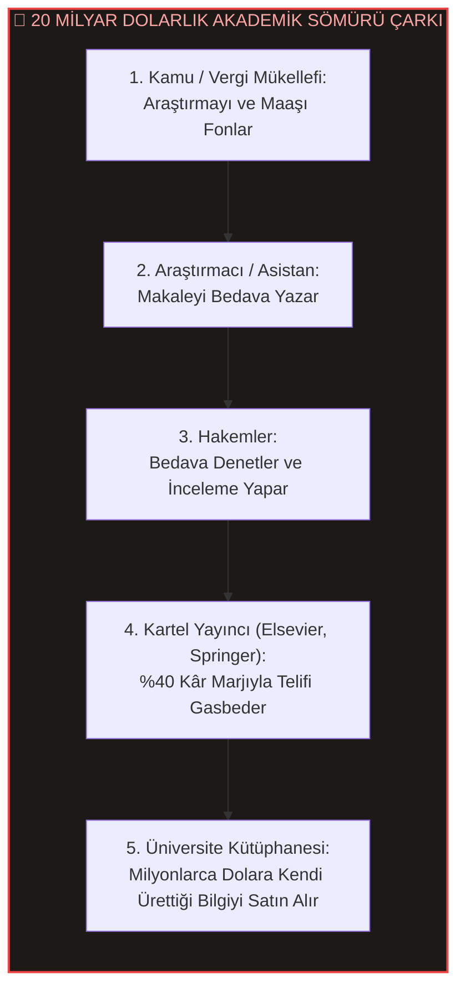
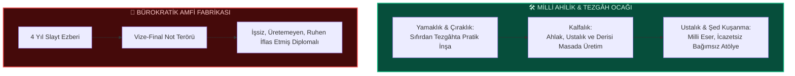
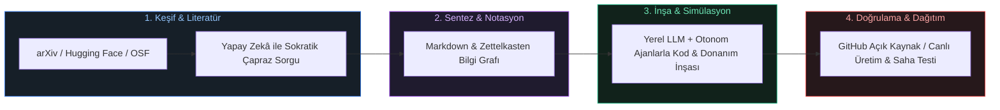
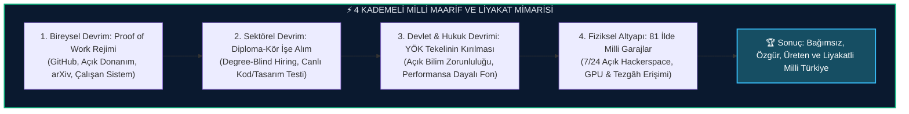

# İdrakin Deli Gömleği: Üniversite, Tecessüsün Katli ve Teslimiyet Senedi

<p align="center">
  
</p>

<p align="center">
  <a href="./MANIFESTO.md"></a>
  <a href="./index.html"></a>
  <a href="https://creativecommons.org/licenses/by-nc-sa/4.0/"></a>
  <a href="./LITERATURE.md"></a>
</p>

> *"İzm'ler idrakimize giydirilen deli gömlekleri. İtibari, samimi olmayan tabular. Kollarımızı bağlayan, bizi birbirimize düşman eden mefhumlar. Düşünceye vurulan zincirler."*  
> — **Cemil Meriç, *Bu Ülke***

> *"Mektep, insanı kendi fıtratına yabancılaştıran, ruhu öldürüp yerine diplomayı ikame eden bir bezirgânlık haline gelmiştir. Hakiki mektep unvan dağıtan değil, hakikate sevdalı şahsiyetler yoğuran ocaktır."*  
> — **Nurettin Topçu, *Türkiye'nin Maarif Davası***

> *"Batı'nın papağanı olmak ilim adamlığı değildir. Kendi diliyle, kendi köküyle, kendi hür aklıyla düşünmeyen adam sömürge aydınıdır. Türkiye'nin kurtuluşu, amfilerin ezberci zincirlerini kırıp milli dehamızı sahada ayağa kaldırmaktan geçer."*  
> — **Prof. Dr. Oktay Sinanoğlu, *Hedef Türkiye***

> *"Sizi rahatsız etmeyen, uykunuzu kaçırmayan, kurulu düzenin konforunu tedirgin etmeyen bir bilgi; ilim değil, sadece bürokratik bir afyondur."*  
> — **Dr. Ali Şeriati, *Kendini Devrimci Yetiştirmek***

> *"Medreselerden aklî ilimlerin (hendese, riyaziye, hikmet) kovulduğu ve yerine salt şekilci ezberin konduğu gün, bu milletin idrakine pas vurulduğu gündür."*  
> — **Kâtip Çelebi, *Mîzânü'l-Hakk fî İhtiyâri'l-Ehakk (1656)***

---

## 📑 Ansiklopedik ve Bilimsel İçindekiler

- [Mesele: Mabedin Çöküşü ve Kurumsallaşan Zihinsel Esaret](#mesele-mabedin-çöküşü-ve-kurumsallaşan-zihinsel-esaret)
- [I. Teslimiyet Senedi Olarak Diploma: İtaatin Belgesi](#i-teslimiyet-senedi-olarak-diploma-itaatin-belgesi)
- [II. Kürsü Derebeyliği ve Hakikatin Maaşa İpoteklenmesi](#ii-kürsü-derebeyliği-ve-hakikatin-maaşa-ipoteklenmesi)
- [III. 1982 YÖK Düzeni: Sistemin Kendi Kurbanlarını Gardiyan Yapma Paradoksu](#iii-1982-yök-düzeni-sistemin-kendi-kurbanlarını-gardiyan-yapma-paradoksu)
- [IV. Maarifin İflası: Sararmış Notlar, Taş Mektep ve Not Terörü](#iv-maarifin-iflası-sararmış-notlar-taş-mektep-ve-not-terörü)
- [V. Dil ve Jargon Tahakkümü: Anlaşılmazlığın Arkasına Saklanan Cehalet](#v-dil-ve-jargon-tahakkümü-anlaşılmazlığın-arkasına-saklanan-cehalet)
- [VI. Feynman'ın Aynası: Ezberleyen Fakat Anlamayan Kargo Kültü Bilimi](#vi-feynmanın-aynası-ezberleyen-fakat-anlamayan-kargo-kültü-bilimi)
- [VII. Erginleşememe Prangası ve Fabrika Tipi Standartlaştırma](#vii-erginleşememe-prangası-ve-fabrika-tipi-standartlaştırma)
- [VIII. Tarihten Günümüze Medrese & Amfi Krizleri: Ali Kuşçu'dan 1933 Reformuna](#viii-tarihten-günümüze-medrese--amfi-krizleri-ali-kuşçudan-1933-reformuna)
- [IX. Milli Bilim Mirası: Cezeri'den Cahit Arf ve Aziz Sancar'a](#ix-milli-bilim-mirası-cezeriden-cahit-arf-ve-aziz-sancara)
- [X. Akademik Yağmacılık, Metrik Putu ve 20 Milyar Dolarlık Yayın Karteli](#x-akademik-yağmacılık-metrik-putu-ve-20-milyar-dolarlık-yayın-karteli)
- [XI. Bilimsel İflas: Tekrarlanabilirlik Krizi ve Ioannidis İtirazı](#xi-bilimsel-iflas-tekrarlanabilirlik-krizi-ve-ioannidis-itirazı)
- [XII. Kürsünün Reddettiği Nobeller: Karikó, Krebs ve Shechtman Vakaları](#xii-kürsünün-reddettiği-nobeller-karikó-krebs-ve-shechtman-vakaları)
- [XIII. Hakem Denetiminin İflası: Sokal Olayı ve Jargon İllüzyonu](#xiii-hakem-denetiminin-iflası-sokal-olayı-ve-jargon-illüzyonu)
- [XIV. İntihal Salgını ve "Tercüme Odası" Akademisyenliği](#xiv-intihal-salgını-ve-tercüme-odası-akademisyenliği)
- [XV. Emek Gasbı, Mobbing ve Depresyon: Nature 2019 Küresel Verileri](#xv-emek-gasbı-mobbing-ve-depresyon-nature-2019-küresel-verileri)
- [XVI. Epistemolojik Körlük: Metodoloji Putu ve Feyerabend'ın İtirazı](#xvi-epistemolojik-körlük-metodoloji-putu-ve-feyerabendın-itirazı)
- [XVII. "Derisi Masada Olmayanlar": Riski Başkasına Yıkan Parazitlik](#xvii-derisi-masada-olmayanlar-riski-başkasına-yıkan-parazitlik)
- [XVIII. Düşüncesizliğin Banalitesi: Bürokratik Memurlaşma ve Vicdan Felci](#xviii-düşüncesizliğin-banalitesi-bürokratik-memurlaşma-ve-vicdan-felci)
- [XIX. Sosyal Tahliye Vanaları: Öfkenin Sönümlenmesi ve Sahte Çıkışlar](#xix-sosyal-tahliye-vanaları-öfkenin-sönümlenmesi-ve-sahte-çıkışlar)
- [XX. Ahilik ve Milli Lonca Tezgâhı: Amfilerden Önceki Hakiki Maarif Ocağı](#xx-ahilik-ve-milli-lonca-tezgâhı-amfilerden-önceki-hakiki-maarif-ocağı)
- [XXI. İstikbal Göklerdedir: Amfilerden Sonsuz Kızıl Elma Ufkuna](#xxi-istikbal-göklerdedir-amfilerden-sonsuz-kızıl-elma-ufkuna)
- [XXII. Otonom Polimatlar Panteonu ve Tarihi Vaka Analizleri](#xxii-otonom-polimatlar-panteonu-ve-tarihi-vaka-analizleri)
- [XXIII. Milli Teknoloji Hamlesi & Dijital Agora: Yerli ve Bağımsız Üretim](#xxiii-milli-teknoloji-hamlesi--dijital-agora-yerli-ve-bağımsız-üretim)
- [XXIV. Tersine Mühendislik ve "Hacking" Kültürü: İdrakin Pratik İlacı](#xxiv-tersine-mühendislik-ve-hacking-kültürü-idrakin-pratik-ilacı)
- [XXV. Açık Donanım ve Garaj Laboratuvarları: Fiziksel Dünyada Amfisiz İnşa](#xxv-açık-donanım-ve-garaj-laboratuvarları-fiziksel-dünyada-amfisiz-inşa)
- [XXVI. Yapay Zekâ Destekli Otonom Polimat Mimarisi: Amfilerin Nihai Ölüm Fermanı](#xxvi-yapay-zekâ-destekli-otonom-polimat-mimarisi-amfilerin-nihai-ölüm-fermanı)
- [XXVII. Günlük 7 Otonom İnşa Disiplini](#xxvii-günlük-7-otonom-inşa-disiplini)
- [XXVIII. Özgür Zihnin Yol Haritası: 12 Sarsılmaz İlke](#xxviii-özgür-zihnin-yol-haritası-12-sarsılmaz-ilke)
- [XXIX. Büyük Zihinlerin Amfi ve Bürokrasi İtirazları Koleksiyonu](#xxix-büyük-zihinlerin-amfi-ve-bürokrasi-itirazları-koleksiyonu)
- [XXX. Akademik İkiyüzlülük Sözlüğü (Jargon Dekoderi)](#xxx-akademik-ikiyüzlülük-sözlüğü-jargon-dekoderi)
- [XXXI. Çözüm Manifestosu & Milli Eylem Planı: Yıkılan Amfilerin Yerine Ne Koyacağız?](#xxxi-çözüm-manifestosu--milli-eylem-planı-yıkılan-amfilerin-yerine-ne-koyacağız)
- [XXXII. Türkiye İçin "Açık Milli Bilim ve Donanım Şartnamesi" (10 Temel Kural)](#xxxii-türkiye-için-açık-milli-bilim-ve-donanım-şartnamesi-10-temel-kural)
- [XXXIII. Kavramsal Karşılaştırma Matrisi](#xxxiii-kavramsal-karşılaştırma-matrisi)
- [XXXIV. Felsefi, Sosyolojik ve Bilimsel Literatür Kaynakçası](#xxxiv-felsefi-sosyolojik-ve-bilimsel-literatür-kaynakçası)

---

```mermaid
flowchart TD
    subgraph Geleneksel Akademi ["🏰 1982 Düzeni & Gardiyanlık Kısırdöngüsü"]
        A[1982 Kışla Düzeni: 2547 Sayılı YÖK Kanunu] --> B[Sistemin Torna ve Biat Aşamasından Geçen Memur]
        B --> C[30 Yıl Çekilen Çile, Eğilen Baş ve Alınan Unvan]
        C --> D[Karar Verici / Rektör / Bakanlık Koltuğuna Oturma]
        D --> E{Kritik Soru: Sistemi Değiştirir mi?}
        E -- "HAYIR! Bilişsel Uyumsuzluk & Statüko Savunması" --> F["Ben çektim, onlar da çekecek!" Sendromu]
        F --> G[Deli Gömleğini Yeni Nesle Giydiren Eski Kurbanlar]
    end

    subgraph Otonom Üretim ["⚡ Milli Teknoloji & İcazetsiz Üretim"]
        H[Vesayet Beklemeden Doğrudan İnşa] --> I[Global Açık Arşivler, LLM, Milli Tezgâh & Laboratuvar]
        I --> J[Doğrudan Üretim: İHA/SİHA, Kod, Donanım, Makale, Prototip]
        J --> K[Skin in the Game: Gerçek Dünya Testi & Bağımsız Doğrulama]
        K --> L[İstikbal Göklerdedir: Hür ve Otonom Türk Dehası]
    end

    style Geleneksel Akademi fill:#1a161f,stroke:#ef4444,stroke-width:2px,color:#fca5a5
    style Otonom Üretim fill:#0e2019,stroke:#10b981,stroke-width:2px,color:#6ee7b7
```

---

### Mesele: Mabedin Çöküşü ve Kurumsallaşan Zihinsel Esaret

İnsan idrakinin en saf, en ele avuca sığmaz itici gücü **tecessüstür**; yani hakikati arama iştiyakı, doymak bilmez bir anlama, sökme ve sıfırdan inşa etme arzusu. Bu arzu doğası gereği serazattır; sınır tanımaz, hiçbir kalıba sığmaz, ne bir binanın harcına hapsedilebilir ne de vizelerin ve finallerin dar takvimine. 

Oysa modern dünya, hakikatin bu vahşi ve kuralsız nehrini ıslah etmek, onu ehlileştirip devlet aygıtının ve sermayenin dişlilerine uyumlu hale getirmek için adına "akademi" denen devasa mabetler inşa etmiştir. Karl Jaspers'ın *Üniversite İdesi* eserinde uyardığı gibi:

> *"Üniversite, hakikatin koşulsuz arandığı bir cemaat olmaktan çıkıp devletin memur ihtiyacını karşılayan bir meslek okuluna veya bürokratik bir aygıta dönüştüğünde kendi ruhunu katleder. Hakikat arayışı kurumsal mekanizmaların emrine verilemez."*  
> — **Karl Jaspers, *Die Idee der Universität***

Cemil Meriç, zihni donduran ithal fikir şablonlarına *"idrake giydirilen deli gömlekleri"* teşhisini koyarken meseleyi salt ideolojik bir körleşme olarak ele alıyordu. Oysa bugün o gömlek, soyut mefhumların sınırlarını aşmış; amfileri, sararmış ders notları, kürsü derebeylikleri ve bürokratik ceza zırhlarıyla **bizatihi modern üniversitenin fiziksel ve kurumsal mimarisine dönüşmüştür.**

Bir alana derin bir merakla, üretme ateşiyle giren bir genç dimağ; üniversite kapısından adım attığı anda hakikatin agorasını değil, ortaçağ lonca sisteminin bürokratik devlet memurluğuyla tahkim edilmiş modern bir karikatürünü bulur. Kendi merakının peşinden gitmek isteyen zihin, sistemin mengenesinde un ufak edilir; heyecan yerini bürokratik yılgınlığa, üretim aşkı ise itaat talimlerine bırakır.

Sezai Karakoç, üniversitenin bu çoraklaşmasını ve ruhunu yitirişini şu veciz feryatla dile getirir:

> *"Üniversite, bir hakikat arayışı ve ruh çilesi olmaktan çıkmış; kartvizit dağıtan, unvan fetişizmini besleyen ve zihni memurlaştıran soğuk bir bürokrasi kalesine dönmüştür. Hakiki diriliş, amfilerin mermerlerine değil, hakikatin çilesine talip olmakla başlar."*  
> — **Sezai Karakoç, *Diriliş Neslinin Âmentüsü***

---

### I. Teslimiyet Senedi Olarak Diploma: İtaatin Belgesi

Toplumsal yanılsama, üniversite diplomasını bir bilgi, liyakat ve erginleşme ehliyeti zanneder. Oysa üniversite fabrikasının banttan indirdiği ürün bilgi değil, uysallaştırılmış memurdur.

> **Diploma, bireye verilen bir ehliyet değil; sistemin onayından geçtiğini, sivriliklerinin törpülendiğini ve uysallaştırıldığını tescilleyen bir teslimiyet senedidir.**

Dört veya beş yıl boyunca bir amfide tescillenen şey zihinsel derinlik değildir:
* Saçma ve çağdışı bir bürokrasiye ses çıkarmadan tahammül edebilme kapasitesi,
* Hocanın bariz cehaletini ve hatalarını yüzüne vurmayacak kadar kendini sansürleme becerisi,
* Anlamsız bir ezberi sınav kâğıdına kusup kapıdan çıktığı an unutmayı kabulleniş,
* Kendi özgün metodolojisini çöpe atıp "kürsünün istediği şablonu" taklit etme ikiyüzlülüğü.

Altına atılan rektör ve dekan imzalarının arkasındaki gizli metin şudur: *"Bu birey artık tehlikesizdir. Köşeleri zımparalanmış, merakı hadım edilmiş, sisteme memur olmaya hazır hale getirilmiştir."* Eğer bir insanın sivrilikleri törpülenmemişse, o diploma ya hiç verilmez ya da o kişi orayı terk etmek zorunda kalır. Çünkü köşe, çarkı bozar; sistem ise sadece pürüzsüz yuvarlanan dişlilerle döner.

> *"Okullaşmış toplumda bilgi bir meta, diploma ise o metanın tekelini elinde tutan loncanın şantaj aracıdır. İnsanlar öğrenme yetilerini okullara devrettikçe kendi meraklarına yabancılaşır ve kurumların sunduğu paket programlar dışında hiçbir şey yapamayacaklarına inandırılırlar."*  
> — **Ivan Illich, *Okulsuz Toplum***

İsmet Özel ise modern diploma fetişizmini ve kurumsal yabancılaşmayı şu keskin ifadelerle teşhis eder:

> *"Diploma, modern insanın efendisine gösterdiği kölelik beratıdır. İnsanlar bir kâğıt parçası uğruna haysiyetlerini, meraklarını ve şahsiyetlerini amfilerin kapısında bırakırlar."*  
> — **İsmet Özel, *Üç Mesele***

---

### II. Kürsü Derebeyliği ve Hakikatin Maaşa İpoteklenmesi

Akademi, bilgi üretiminin ve hür tefekkürün kalesi olduğu iddiasıyla meşruiyet devşirir; oysa gerçekte unvan tüccarlarının ve konfor alanı bekçilerinin patrimonyal mülküdür. Arthur Schopenhauer, ta 19. yüzyılda bu sahte kutsallığın maskesini acımasızca indirmiştir:

> *"Hakikati aramakla değil, devletten alacağı maaşla ve kürsüdeki koltuğuyla ilgilenen unvan sahipleri felsefeyi ve bilimi boğar. Üniversite felsefesi, hakikatin değil; geçim derdinin, itibar avcılığının ve bakanlıkların talimatlarının hizmetindedir. Hakikat ise tehlikelidir, rahat bozar; bu yüzden üniversite kürsülerine asla yaklaştırılmaz."*  
> — **Arthur Schopenhauer, *Üniversite Felsefesi Üzerine***

Üniversite hocası, kürsüsünü bir araştırma tezgâhı değil, ferman dağıttığı feodal bir tımar arazisi olarak görür. Kendisine soru sorulmasını cehaletine yöneltilmiş bir tecavüz, literatürün güncel halinin hatırlatılmasını ise "hocalık onuruna hakaret" sayar. Celal Şengör'ün şu tespiti, bu toprakların amfilerindeki değişmez trajediyi doğrudan yüzümüze çarpar:

> *"Bizde üniversite hocası kendini yarı-tanrı zanneder. Odasına girerken titrersin, soru sorarsan düşman beller. Bu kafa feodal kabile reisliği kafasıdır. Bu kafayla dünya çapında tek bir bilim insanı yetiştiremezsin; yetiştiklerini de Batı'ya kaçırırsın."*  
> — **Prof. Dr. A. M. Celal Şengör**

---

### III. 1982 YÖK Düzeni: Sistemin Kendi Kurbanlarını Gardiyan Yapma Paradoksu

Neden 12 Eylül 1980 darbesinin ürünü olan, 1981-1982'de kurulan 2547 sayılı YÖK düzeni ve bu boğucu bürokrasi 40 yılı aşkın süredir değişmez? Neden sistemi eleştirenler dahi iktidar olduğunda bu nizamı tasfiye etmez?

Cevap, sosyolojinin en karanlık gerçeğinde saklıdır: **Sistemi değiştirebilecek karar verici makamlara oturanların tamamı, bizzat o sistemin tornasından geçmiş, onun diplomasını almış ve onun kurbanı olmuş insanlardır.**

```
┌─────────────────────────────────────────────────────────────────────────────┐
│                   KURUMSAL GARDİYANLIK KISIRDÖNGÜSÜ                         │
├─────────────────────────────────────────────────────────────────────────────┤
│ 1. Gençlikte İtaat: 20'li yaşlarda asistan olur; hocasının çantasını taşır,  │
│    mobbinge susar, ezber yapar, baş eğer.                                  │
│ 2. Bedel Yatırımı (Sunk Cost Fallacy): 30 yıl boyunca gençliğini, onurunu  │
│    ve özgün düşüncesini o unvan ve kadro için feda eder.                   │
│ 3. Makama Ulaşma: 50'li yaşlarda Rektör, Dekan, YÖK Üyesi, Bakan olur.     │
│ 4. Bilişsel Uyumsuzluk & İntikam: "Ben 30 yıl bu çileyi çektim, bu sınavları│
│    verdim, bu jürilerden geçtim; şimdi sistemi kaldırırsam benim çektiğim  │
│    eziyetin, aldığım unvanın ne anlamı kalır?" der.                        │
│ 5. Gardiyanlaşma: Eski kurban, artık sistemin en tavizsiz celladı olur.    │
└─────────────────────────────────────────────────────────────────────────────┘
```

Amerikalı yazar Upton Sinclair'in meşhur tespiti tam burayı tarif eder:

> *"Bir adama, maaşı ve statüsü bir şeyi anlamamasına bağlıyken o şeyi anlatmak imkânsızdır."*  
> — **Upton Sinclair**

Robert Michels'in *"Oligarşinin Tunç Kanunu"* uyarınca, bürokratik yapılar zamanla amacından sapar ve tek amacı kendi varlığını sürdürmek olan kapalı kastlara dönüşür. 1982 düzeni bu yüzden içeriden reforme edilemez; çünkü **içerideki herkes, o düzenin suç ortağı ve hissedarı haline getirilmiştir.**

Diplomalı bir zihinden, diplomasızlığın ve icazetsiz üretimin önünü açacak bir devrim beklenemez. Sistemi değiştirecek olanlar, amfilerin icazetini reddedip kendi tezgâhında üretenlerdir.

---

### IV. Maarifin İflası: Sararmış Notlar, Taş Mektep ve Not Terörü

<p align="center">
  
</p>

Üniversite amfisi ve sınav salonu, nesnel bilginin ölçüldüğü tarafsız alanlar değildir. Michel Foucault'nun hapishane, kışla ve hastane üçgeninde analiz ettiği disiplinci iktidarın en rafine uygulama sahalarıdır.

> *"Disiplinci iktidar, bireyleri uysal bedenler haline getirmek için çalışır. Sınav ritüeli bu uysallaştırmanın doruk noktasıdır; bireyi sürekli bir gözetim, kayıt ve hiyerarşik sınıflandırma mekanizmasına hapseder. Sınavda amaç bilginin derinliği değil; iktidarın normuna ne kadar kusursuz uyulduğunun denetlenmesidir."*  
> — **Michel Foucault, *Hapishanenin Doğuşu***

Nurettin Topçu'nun *Türkiye'nin Maarif Davası*nda haykırdığı gibi:

> *"Mektep diploma tüccarlığına, amfiler memur kışlasına dönmüştür. Hakiki muallim talebesine unvan değil şahsiyet aşılar; talebesinin zihnini sararmış notlara değil kâinatın sırlarına açar. Ruhsuz bilgi kalbi taşlaştırır, zihni köleleştirir."*  
> — **Nurettin Topçu**

Paulo Freire'nin "bankacı eğitim modeli" tam bu noktada işler: Öğrenci, hocanın 25 yıl önce daktiloyla yazılmış ders notlarındaki bariz bir hatayı dahi düzeltemez; çünkü o hatayı papağan gibi tekrarlamak sınavdan geçmenin, itiraz edip doğrusunu göstermek ise dersten kalmanın mutlak garantisidir. Birey, aklını kürsünün cehaletine teslim ettiği ölçüde "başarılı" ilan edilir.

---

### V. Dil ve Jargon Tahakkümü: Anlaşılmazlığın Arkasına Saklanan Cehalet

Akademik zümre, kendi kısırlığını ve fikir fukaralığını gizlemek için adına "akademik dil" dediği yapay, ağdalı ve anlaşılmaz bir jargon şatosu inşa eder. Basit bir gerçeği herkesin anlayabileceği durulukta söylemek, akademinin sahte büyücülük tekeline tehdit sayılır.

George Orwell, *Siyaset ve İngiliz Dili* denemesinde bu durumu şöyle teşhir eder:

> *"Akademik ve bürokratik jargon, düşünceyi derinleştirmek için değil; saçmalığı saygın göstermek, yalanı hakikat kılığına sokmak ve boşluğa sağlamlık süsü vermek için icat edilmiştir."*  
> — **George Orwell, *Politics and the English Language***

Arthur Schopenhauer ise bu sahte bilgeliği şu tokat gibi sözlerle yerin dibine batırır:

> *"Açık düşünen insan açık yazar. Bulanık, anlaşılmaz ve ağdalı yazanlar ise aslında kafalarında ne olduğunu kendileri de bilmeyen şarlatanlardır. Bir fikri derin göstermenin en ucuz yolu, onu anlaşılmaz kılmaktır."*  
> — **Arthur Schopenhauer, *Yazarlık ve Üslup Üzerine***

---

### VI. Feynman'ın Aynası: Ezberleyen Fakat Anlamayan Kargo Kültü Bilimi

Nobel Fizik Ödüllü Richard Feynman, ezberci akademi dünyasını sarsan şu tarihî teşhisi koyar:

> *"Öğrencilerin her şeyi harfiyen ezberlediğini gördüm. Kitaptaki formülleri ezbere okuyor, sınav sorularına kitaptaki cümlelerle kusursuz yanıtlar veriyorlardı. Ama onlara doğadan somut tek bir örnek sorduğumda, ışığın bir aynaya veya suya çarptığında ne yaptığını sorduğumda tam bir sessizlik oluyordu! Hiçbir şey anlamamışlardı. Sadece kelimeleri ve sembolleri papağan gibi ezberlemişlerdi. Bu bilim değil; bilimin taklididir, bir kargo kültüdür."*  
> — **Richard Feynman, *Surely You're Joking, Mr. Feynman!***

Ali Şeriati bu duruma "öğretilmiş cehalet" adını verir:

> *"Öğretilmiş cehalet, bilmeyen insanın cehaletinden bin kat daha tehlikelidir. Çünkü diplomalı cahil, bildiğini zannettiği için hakikati aramayı bütünüyle bırakmıştır."*  
> — **Ali Şeriati, *Kendini Devrimci Yetiştirmek***

---

### VII. Erginleşememe Prangası ve Fabrika Tipi Standartlaştırma

Immanuel Kant, aydınlanmayı bir hürriyet manifestosu olarak sunarken, insanın kendi aklını başkalarının rehberliği olmadan kullanamayışını "ergin olmama hali" olarak tarif ediyordu:

> *"Aydınlanma; insanın kendi suçu ile düşmüş olduğu bir ergin olmama durumundan kurtulmasıdır. Bu ergin olmayış durumu ise, insanın kendi aklını bir başkasının kılavuzluğuna başvurmaksızın kullanamayışıdır. Sapere Aude! Kendi aklını kullanma cesaretini göster!"*  
> — **Immanuel Kant, *Aydınlanma Nedir?***

Friedrich Nietzsche ve Bertrand Russell ise üniversitelerin devasa birer memur imalat bandı olduğunu teşhis etmiştir:

> *"Mevcut yükseköğretim kurumları dehanın değil, faydalı ve itaatkâr memurların yetiştirilmesini hedefler. Amaç, tek tek bireyleri tek tip tornadan geçirerek devlet çarkının uysal birer dişlisi haline getirmektir."*  
> — **Friedrich Nietzsche, *Eğitim Kurumlarımızın Geleceği Üzerine***

---

### VIII. Tarihten Günümüze Medrese & Amfi Krizleri: Ali Kuşçu'dan 1933 Reformuna

Türkiye'de bilgi üretiminin kurumsal prangalarla boğulması dün başlamamıştır. Tarih, hakiki tecessüsün bürokratik taassupla çatışmasının ibretlik sahneleriyle doludur:

1. **Sahn-ı Seman ve Ali Kuşçu'nun Altın Çağı:** Fatih Sultan Mehmed, Semerkand'ın büyük matematikçi ve astronomu Ali Kuşçu'yu İstanbul'a davet ederek medreseleri matematik ve astronomi temeline oturtmuştu. Hakikat arayışı ve hendese el üstündeydi.
2. **1580 İstanbul Rasathanesi'nin Yıktırılması Trajedisi:** Takiyüddin er-Râsıd'ın kurduğu ve Tycho Brahe'nin rasathanesinden daha üstün aletlerle donatılmış Tophane Rasathanesi; Şeyhülislam Kadızade'nin *"Gökleri gözetlemek uğursuzluk getirir"* fetvasıyla Kaptan-ı Derya Kılıç Ali Paşa'nın gemilerinden atılan top atışlarıyla yerle bir edildi. Bu top atışları, Doğu'nun bilimsel idrakine vurulan en ağır deli gömleğiydi.
3. **Kâtip Çelebi'nin Feryadı:** 17. yüzyılda Kâtip Çelebi *Mîzânü'l-Hakk*'ta, medreselerden mantık ve riyaziye (matematik) derslerinin kaldırılmasıyla ilmin yerini dedikodu ve taassubun aldığını acıyla kaydetti.
4. **1933 Üniversite Reformu ve Darülfünun Tasfiyesi:** İsviçreli pedagog Prof. Albert Malche'nin raporuyla Darülfünun lağvedildi. Rapor; hocaların yabancı dil bilmediğini, sararmış notları papağan gibi tekrarladığını ve dünya literatüründen bütünüyle koptuğunu belgeliyordu. 

Bu tarihi döngü göstermektedir ki; kurumlar değişse de (Medrese -> Darülfünun -> Üniversite), bürokratik zihniyet tecessüsü boğma refleksini daima korumuştur.

---

### IX. Milli Bilim Mirası: Cezeri'den Cahit Arf ve Aziz Sancar'a

<p align="center">
  
</p>

Bu topraklar; amfilerin bürokratik vesayetine sığmayan, bizzat tezgâhında üreten devasa bir bilim ve inşa mirasına sahiptir:

* **Bedîüzzaman el-Cezeri (1136–1206):** Saray bürokrasisine boyun eğmeden, Artuklu diyarında hidrolik otomatları, çift etkili emme basma tulumbalarını, krank millerini ve su saatlerini bizzat elleriyle inşa etti; sibernetiğin ve robotik mühendisliğin kurucusu oldu. *"Uygulamaya dökülmeyen her bilgi doğru ile yanlış arasında asılı kalır"* diyerek amfi teorisyenliğine 800 yıl önceden tokat attı.
* **Ord. Prof. Dr. Cahit Arf (1910–1997):** *"Üniversite, hocanın dediklerinden şüphe duyup daha doğrusunu arayanların yeridir"* diyerek Arf Değişmezi, Arf Halkaları ve Arf Kapanışları ile dünya matematik literatürüne silinmez bir mühür vurdu.
* **Prof. Dr. Oktay Sinanoğlu (1935–2019):** *"Türkiye'de üniversiteler feodal beylikler haline getirilmiştir. Deha bu çarkı kırandır"* diyerek Yale Üniversitesi'nde 26 yaşında 20. yüzyılın en genç tam profesörü oldu; atom ve moleküllerin çoklu elektron teorisini kurdu.
* **Prof. Dr. Aziz Sancar:** *"Bana Amerika'da 'Sen kimsin, hocana nasıl karşı çıkarsın?' demediler; 'Ne buldun, teorin ne?' dediler. Liyakat olan yerde bilim yeşerir; liyakat olmayan yerde sadece dalkavukluk yeşerir"* diyerek Nobel Kimya Ödülü'ne uzandı.

---

### X. Akademik Yağmacılık, Metrik Putu ve 20 Milyar Dolarlık Yayın Karteli

21. yüzyıl üniversitesi, hakikat arayışını bütünüyle terk ederek adına "akademik teşvik" denen bir puan avcılığına ve küresel yayın tekellerinin sömürüsüne teslim olmuştur. Goodhart Yasası burada kusursuz biçimde işler: **"Bir metrik bir hedef haline geldiğinde, iyi bir metrik olmaktan çıkar."**



1. **Yayın Kartellerinin (Elsevier, Springer, Wiley) Gasp Düzeni:** Bilim insanları araştırmayı kamu parasıyla yapar, makaleyi ücretsiz yazar, hakemler makaleyi bedavaya inceler; ancak küresel tekel yayıncılar bu kamu malı bilgiyi tek bir PDF başına 40-50 dolar ödeme duvarının (*paywall*) arkasına hapseder. Kâr marjları Apple, Google veya petrol devlerinden daha yüksektir (%38-42).
2. **Aaron Swartz'ın Ölümsüz İtirazı:** 26 yaşında bu soyguna başkaldıran ve bilginin kamuya ait olduğunu savunan dahi aktivist Aaron Swartz, *Guerilla Open Access Manifesto* ile tarihe şu notu düşmüştür:
   > *"Dünyanın tüm bilimsel ve kültürel mirası —yüzyıllardır kitaplarda ve dergilerde basılmış olan insanlık hafızası— gitgide dijitalleştirilip bir avuç özel şirketin elinde kilit altına alınıyor. Bilim insanlarına araştırmalarını bedavaya yazdırıp halka parayla satan bu tekele boyun eğmek ahlaki değildir. Bilgiye erişim bir ayrıcalık değil, evrensel bir insan hakkıdır."*  
   > — **Aaron Swartz, *Guerilla Open Access Manifesto (2008)***
3. **Paralı Yağmacı Dergiler (*Predatory Journals*):** 300-1500 dolar karşılığında hakem sürecini 3 günde tamamlayıp hiçbir bilimsel değeri olmayan çöp metinleri yayınlayan dergilerle doçentlik ve profesörlük toplayan bir bürokrasi ordusu türemiştir.
4. **Atıf Çeteleri (*Citation Cartels*):** Kürsü üyeleri, birbirlerinin hiçbir işe yaramayan makalelerine zoraki atıflar yaparak H-index puanlarını yapay olarak şişirir; liyakatli genç araştırmacıların önünü bu kartellerle keserler.
5. **Makale Dilimleme (*Salami Slicing*):** Tek bir anlamlı deney veya algoritma, 5 farklı parçaya bölünerek 5 ayrı yayın gibi sunulur. Amaç bilime katkı değil, teşvik puanını maksimize etmektir.

---

### XI. Bilimsel İflas: Tekrarlanabilirlik Krizi ve Ioannidis İtirazı

Stanford Üniversitesi'nden John Ioannidis'in meşhur 2005 makalesi *"Why Most Published Research Findings Are False"* (Yayınlanan Çoğu Bilimsel Bulgu Neden Yanlıştır?) ve *Nature* dergisinin 1.576 bilim insanıyla yaptığı 2016 küresel araştırması, akademinin içine düştüğü derin bataklığı gözler önüne sermiştir:

```
┌─────────────────────────────────────────────────────────────────────────────┐
│               NATURE 2016 KÜRESEL TEKRARLANABİLİRLİK ANKETİ                 │
├─────────────────────────────────────────────────────────────────────────────┤
│ • Araştırmacıların %70'inden fazlası başka bir bilim insanının deneyini    │
│   tekrarlamayı denemiş ve BAŞARISIZ OLMUŞTUR.                              │
│ • Bilim insanlarının %52'si KENDİ DENEYİNİ dahi tekrarlayamamıştır.         │
│ • Ankete katılanların %90'ı bilimde derin bir kriz olduğunu kabul etmiştir.│
└─────────────────────────────────────────────────────────────────────────────┘
```

---

### XII. Kürsünün Reddettiği Nobeller: Karikó, Krebs ve Shechtman Vakaları

* **Katalin Karikó (2023 Nobel Tıp Ödülü):** mRNA aşı teknolojisinin kurucusu Karikó'nun çığır açan makalesi hem *Nature* hem de *Science* tarafından reddedildi. UPenn tarafından unvanı düşürüldü (*demoted*), laboratuvar fonları kesildi.
* **Hans Krebs (1953 Nobel Tıp Ödülü):** Sitrik Asit Döngüsü makalesi *Nature* dergisi tarafından *"yerimiz yok"* denilerek geri çevrildi.
* **Dan Shechtman (2011 Nobel Kimya Ödülü):** Yarı-kristalleri (*quasicrystals*) keşfettiğinde Linus Pauling tarafından alay edilip araştırma grubundan kovuldu; yıllar sonra Nobel'i tek başına aldı.
* **Peter Higgs (2013 Nobel Fizik Ödülü):** Higgs Bozonu makalesi CERN Physics Letters tarafından *"fiziksel dünyaya uygulanabilirliği yok"* denilerek reddedildi.

---

### XIII. Hakem Denetiminin İflası: Sokal Olayı ve Jargon İllüzyonu

1996 yılında fizik profesörü Alan Sokal'ın postmodern zırvalardan ibaret makalesinin saygın hakemli dergi *Social Text* tarafından ciddiyetle basılması ve 2018'deki *Sokal Squared* deneyinde 20 uydurma makalenin saygın dergilerden tam not alması; amfilerin "hakemli yayın" putunun ideolojik onay ve jargon büyücülüğünden ibaret olduğunu kanıtlamıştır.

---

### XIV. İntihal Salgını ve "Tercüme Odası" Akademisyenliği

Cemil Meriç bu trajediye *"Tercüme Odası Entelektüeli"* adını verir:

> *"Kendi semamızın yıldızlarına gözlerini kapayıp Batı'nın sönük lambalarına pervanelik edenler, bu millete kılavuzluk edemezler. Düşünce tercüme edilemez; tefekkür bizzat kendi toprağında, kendi diliyle ve kendi sancısıyla doğar."*  
> — **Cemil Meriç, *Umrandan Uygarlığa***

---

### XV. Emek Gasbı, Mobbing ve Depresyon: Nature 2019 Küresel Verileri

*Nature* dergisinin 6.300'den fazla lisansüstü araştırmacıyla yaptığı 2019 Küresel Araştırması:

```
┌─────────────────────────────────────────────────────────────────────────────┐
│                 NATURE 2019 KÜRESEL DOKTORA VE ASİSTAN RAPORU               │
├─────────────────────────────────────────────────────────────────────────────┤
│ • Araştırmacıların %36'sı akademik süreç kaynaklı ANKSİYETE ve DEPRESYON    │
│   için profesyonel yardım aradığını belirtmektedir.                         │
│ • %21'i doğrudan MOBBİNG ve ZORBALIĞA maruz kaldığını açıklamıştır.         │
│ • Zorbalık yapanların %48'i doğrudan kendi tez danışmanı veya hocasıdır.    │
│ • Mobbinge uğrayanların %57'si intikam ve kadro korkusuyla SESİNİ ÇIKARAMAZ.│
└─────────────────────────────────────────────────────────────────────────────┘
```

---

### XVI. Epistemolojik Körlük: Metodoloji Putu ve Feyerabend'ın İtirazı

Akademi, düşünceyi sadece kendi onayladığı dar şablonlara hapseder; biçimi özün, metodolojiyi hakikatin önüne koyar. Paul Feyerabend, *Yönteme Karşı* eserinde bu epistemolojik bağnazlığı yerle bir etmiştir:

> *"Bilim tarihi göstermektedir ki, insanlığın en büyük sıçramaları ve devrimci keşifleri; yerleşik yöntem kuralları bilerek veya sezgisel olarak çiğnendiğinde yapılmıştır. Kurallara harfiyen uyan bir bilim, bürokratik bir ayinden başka bir şey değildir. Tek evrensel ilke vardır: Her şey uyar (Anything goes)!"*  
> — **Paul Feyerabend, *Against Method***

Gaston Bachelard ise *Bilimsel Zihnin Oluşumu* eserinde en büyük epistemolojik engelin kurumsal dogmalar olduğunu vurgular:

> *"Hakiki bilim insanı, daha önce öğrenmiş olduğu şeyleri unutabilme ve amfilerin tescil ettiği kesinlikleri yıkabilme cesaretine sahip olandır. Kurumsal kesinlik, düşüncenin mezar taşıdır."*  
> — **Gaston Bachelard**

---

### XVII. "Derisi Masada Olmayanlar": Riski Başkasına Yıkan Parazitlik

Nassim Nicholas Taleb'in *Skin in the Game* (Derini Masaya Koymak) kuramı; amfi akademisyenliğinin ahlaki çöküşünü en çıplak haliyle açıklar:

> *"Bir teoriyi ortaya atan, ahkâm kesen ama o teorinin çöküşünden zerre kadar maddi veya manevi zarar görmeyen (no skin in the game) akademisyenin fikirleri fildişi kulenin boş gevezeliğidir. Gerçek hakikat; sanayide motor tasarlayan, tarlada tohum eken, bilgisayarında çalışan kod yazan ve hatasının bedelini bizzat ödeyen sahici üreticinindir."*  
> — **Nassim Nicholas Taleb**

Paulo Freire ise *Ezilenlerin Pedagojisi* kitabında ezberci eğitim düzenini "Bankacı Eğitim Modeli" olarak niteler:

> *"Hoca dolduran, öğrenci ise içine içi boş kelimelerin yatırıldığı pasif bir banka hesabıdır. Bu pedagoji insanı özgürleştirmez; onu sisteme uysal bir seyirci haline getirir."*  
> — **Paulo Freire**

---

### XVIII. Düşüncesizliğin Banalitesi: Bürokratik Memurlaşma ve Vicdan Felci

Hannah Arendt'in *Eichmann Kudüs'te* eserinde geliştirdiği "Kötülüğün Sıradanlığı" (Banality of Evil) kavramı, modern amfilerdeki vicdan felcini resmeder:

> *"Kötülük her zaman canavarlar tarafından işlenmez; çoğu zaman sadece yönetmeliklere harfiyen uyan, kendi aklıyla düşünmeyi, sorgulamayı ve vicdanının sesini dinlemeyi bırakmış sıradan memurların ellerinde sıradanlaşır."*  
> — **Hannah Arendt**

Noam Chomsky ve Edward Said, entelektüelin bu bürokratik çarkta memurlaştırılmasını şu tarihi ikazlarla teşhir ederler:

> *"Entelektüelin birinci görevi, hakikati iktidarın yüzüne haykırmak ve yalanları ifşa etmektir. Unvan peşinde koşan, bakanlık onaylarına ve kürsü konforuna teslim olan akademisyen entelektüel değil; statükonun kâtibidir."*  
> — **Noam Chomsky & Edward Said**

---

### XIX. Sosyal Tahliye Vanaları: Öfkenin Sönümlenmesi ve Sahte Çıkışlar

Byung-Chul Han (*Psikopolitika*) ve Michel Foucault (*Hapishanenin Doğuşu*); sistemin kendi ürettiği zihinsel buhranı ve gençliğin meşru öfkesini 4 kurumsal tahliye vanasıyla buharlaştırdığını belgeler:

1. **AÖF (Açıköğretim) Koridoru:** Gerçek bir üretim veya zihinsel gelişim sunmayan, sadece diplomalı işsizler ordusunu kağıt üzerinde "öğrenci" göstererek toplumsal patlamayı erteleyen devasa bir istatistik illüzyonu.
2. **KYK Tamponu ve Harçlık Avuntusu:** Genç dimağları barınma ve temel geçim kaygısıyla meşgul ederek sorgulama, araştırma ve isyan etme mecalini tüketme mekanizması.
3. **Ek Madde 1 & Yatay Geçiş Serabı:** Bir amfinin cehenneminden diğer amfinin arafına kaçmayı "kurtuluş" gibi sunan sahte bir coğrafi rotasyon.
4. **Periyodik Öğrenci Afları:** Sistemin kendi iflasını itiraf etmek yerine; her seçim döneminde aftan medet umduran ve gençliği devlete bağımlı kılan kronik af uyuşturucusu.

---

### XX. Ahilik ve Milli Lonca Tezgâhı: Amfilerden Önceki Hakiki Maarif Ocağı

Bu toprakların hakiki eğitim ve üretim modeli; 1982'nin bürokratik amfileri değil, Ahi Evran'ın kurduğu **Ahilik ve Fütüvvet Tezgâhıdır**:



* **"El Almak" ve Tezgâhta Pişmek:** Ahilikte bilgi kağıt parçasıyla değil, ustanın yanında bizzat talaş yutarak, demir döverek, devre kurarak aktarılırdı.
* **Pabucu Dama Atılmak (Liyakat Denetimi):** Kusurlu, hileli veya çürük mal üreten ustanın pabucu dama atılır, meslekten men edilirdi. Oysa bugün amfilerde 30 yıldır tek bir satır özgün kod yazmamış veya cihaz üretmemiş profesörler ömür boyu dokunulmazlık zırhıyla korunmaktadır.

---

### XXI. İstikbal Göklerdedir: Amfilerden Sonsuz Kızıl Elma Ufkuna

<p align="center">
  
</p>

Hakiki ilim, amfilerin mermer duvarlarına kurban edilemez. Gazi Mustafa Kemal Atatürk'ün *"İstikbal göklerdedir"* şiarı; Türk gençliğinin amfi vesayetini yırtıp semalara, uzaya ve bağımsız yüksek teknolojiye yürümesini emreder. Amfiler yerinde sayanların, gökler ise sınır tanımayan hür idraklerindir.

---

### XXII. Otonom Polimatlar Panteonu ve Tarihi Vaka Analizleri

```
┌─────────────────────────────────────────────────────────────────────────────┐
│                       OTONOM DEHALARIN TARİHİ ÇİZGİSİ                       │
├──────────────────────┬────────────────────────┬─────────────────────────────┤
│ Şahsiyet             │ Amfi / Akademi Bağı    │ Devrimci Eseri / Mirası     │
├──────────────────────┼────────────────────────┼─────────────────────────────┤
│ El-Cezeri            │ Lonca / Tezgâh         │ Sibernetik, Krank Mili, Robot│
│ Leonardo da Vinci    │ Amfisiz (Harfsiz Adam) │ Anatomi, Helikopter, Resim  │
│ Nikola Tesla         │ Üniversiteyi Terk Etti │ Alternatif Akım (AC), Radyo │
│ Srinivasa Ramanujan  │ Unvansız / Defter      │ Modüler Fonksiyonlar, Seri  │
│ Nuri Demirağ         │ Bürokrasisiz Girişim   │ İlk Yerli Türk Uçağı (Nu.D) │
│ Şakir Zümre          │ İstiklal Sanayicisi    │ İlk Yerli Mühimmat & Bomba  │
│ Aaron Swartz         │ MIT'ye Meydan Okudu    │ RSS, Markdown, Sci-Hub Ruhu │
│ Linus Torvalds       │ Oturma Odası Hacker'ı  │ Linux Çekirdeği, Git        │
│ George Hotz (geohot) │ Garaj / Tersine Müh.   │ iOS Jailbreak, openpilot    │
│ Selçuk Bayraktar     │ Saha / Hangâr Tezgâhı  │ Bayraktar TB2, Akıncı, Kızılelma│
└──────────────────────┴────────────────────────┴─────────────────────────────┘
```

---

### XXIII. Milli Teknoloji Hamlesi & Dijital Agora: Yerli ve Bağımsız Üretim

<p align="center">
  
</p>

21. yüzyıl Türk mühendisi ve araştırmacısı; amfilerin sararmış notlarına mahkûm değildir. Milli Teknoloji Hamlesi'nin otonom ruhuyla KAAN, Kızılelma, Bayraktar TB3, TÜRKSAT ve Türkçe LLM modelleri yerli hangarlarda, sahada ve amfisiz tezgâhlarda tasarlanmaktadır. 

---

### XXIV. Tersine Mühendislik ve "Hacking" Kültürü: İdrakin Pratik İlacı

İdrake giydirilen deli gömleğini parçalamanın en etkili pratik yöntemi **Tersine Mühendislik (Reverse Engineering)** ve sahici **Hacker Etiği**dir:
1. **Kara Kutuyu Aç:** Sana sunulan donanımı veya yazılımı sadece tüketici olarak kullanma; sök, devre şemasını çıkar, sinyallerini osiloskopla dinle ve çalışma prensibini çöz.
2. **Kodu ve Eseri Konuştur:** Steven Levy'nin *Hackers* kitabında formüle ettiği gibi: *"Bürokrasiye değil, çalışan koda ve esere güven."*
3. **Milli Özgür Yazılım:** Açık kaynaklı Linux çekirdeği, açık derleyiciler (LLVM/GCC) ve yerli siber güvenlik araçlarıyla küresel yazılım tekelini kır.

---

### XXV. Açık Donanım ve Garaj Laboratuvarları: Fiziksel Dünyada Amfisiz İnşa

Akademik tekel sadece yazılımda değil, laboratuvar donanımlarında da kırılmıştır:
* **Açık Kaynak Donanım (OSHW):** Arduino, Raspberry Pi, ESP32 ve açık mimarili RISC-V çipleriyle tek bir genç kendi işlemci mimarisini tasarlayabilmektedir.
* **Masaüstü Fabrikasyon:** 3D yazıcılar ve masaüstü CNC tezgahlarıyla 50 yıl önce koca bir enstitünün yapamadığı mekanik prototiplemeyi kendi odasında tamamlamaktadır.
* **Açık Bilimsel Cihazlar:** Kendi açık mikroskobunu (Foldscope), elektroensefalografi (OpenBCI) cihazını ve spektrometresini inşa ederek üniversitenin kilitli laboratuvarlarına muhtaç olmadan deneysel bilim yapmaktadır.

---

### XXVI. Yapay Zekâ Destekli Otonom Polimat Mimarisi: Amfilerin Nihai Ölüm Fermanı

Gelişmiş büyük dil modelleri (LLM'ler), yapay zekâ kodlama asistanları ve yerel çalışan açık ağırlıklı modeller (DeepSeek, Llama, Ollama); üniversite kürsülerinin asırlık bilgi tekelini tarihe gömmüştür:



* **1 Kişilik Enstitü Kapasitesi:** Bugün tek bir bağımsız genç, yapay zekâ asistanlarıyla birlikte eskiden 20 kişilik bir akademik kürsünün 6 ayda yaptığı literatür taramasını, matematiksel modellemesini ve prototip kodlamasını 2 günde bitirebilmektedir.
* **Hocanın Slaytına Karşı Sınırsız Sokratik Hoca:** Anlamadığın bir kuantum mekaniği denklemini veya diferansiyel geometri teoremini sana 100 farklı analojiyle bıkmadan anlatan, asla kibirlenmeyen ve notla tehdit etmeyen küresel bir zekâ ağı elinin altındadır.

---

### XXVII. Günlük 7 Otonom İnşa Disiplini

1. **Günde 1 Saat Orijinal Mimari ve Kaynak Kod Oku:** Hocanın slaytını değil, Linux çekirdeğini ve açık makaleleri oku.
2. **Her Gün 'Proof of Work' Üret:** Git commit'i, lehimlenmiş devre, yazılmış teknik analiz; günü boş geçirme.
3. **İlk İlkelere (First Principles) İn:** Formülü ezberleme, atomik gerçeğine kadar sök.
4. **Otoriteyi Değil Delili Tart:** Rütbeleri değil çalışan sistemleri esas al.
5. **Kişisel Bilgi Ağını (PKM) Büyüt:** Markdown & Zettelkasten ile kalıcı bilgi inşa et.
6. **Milli Kökler & Küresel Standart:** Yerli dertleri evrensel liyakatle çöz.
7. **Bedel Ödemekten Korkma:** Hata keşfin başlangıcıdır; derini masaya koy.

---

### XXVIII. Özgür Zihnin Yol Haritası: 12 Sarsılmaz İlke

1. **İcazet Arama Hastalığından Kurtul:** Üretmek için bir profesörün onayına, bir kürsünün lütfuna ihtiyacın yok.
2. **Kodu ve Eseri Konuştur:** Diplomanın süslü yalanları karşısında en dürüst hakem çalışan açık kaynak kod ve milli üretimdir.
3. **Derini Masaya Koy (Skin in the Game):** Risk alan, inşa eden, test eden ve bedel ödeyen sahici bir üretici ol.
4. **Amfiyi Araçsallaştır:** Üniversitedeysen orayı sadece bir altyapı istasyonu (cihaz, kütüphane, network) gör; zihnini rektörlük nizamına teslim etme.
5. **Sararmış Notları Yak:** Dünyanın en güncel açık yayınları ve milli vizyonla beslen.
6. **Kendi Laboratuvarını Tezgâhında Kur:** Masaüstün, lehim havyası ve yerel LLM çalışma alanın senin en büyük enstitündür.
7. **Kargo Kültü Ezberini Reddet:** Richard Feynman gibi, anlamadığın formülü papağan gibi tekrarlama; sistemi bizzat deneysel sök ve anla.
8. **Açık Lisans Kalkanı Kullan:** Emeğini açık kaynak lisanslarıyla (MIT, Apache, CC) mühürle; kürsü derebeylerinin zoraki yazarlık tuzağına düşme.
9. **Akran Öğrenimini Esas Al:** Hiyerarşi yerine global topluluklarla ve akranlarınla yatay düzlemde öğren.
10. **Not Terörüne Bağışıklık Kazan:** Harf notları zekânın değil, itaatin ölçüsüdür; karneleri ruhuna kazıma.
11. **Polimat ve Otonom Ol:** Sadece tek bir dar disiplinin uzmanı değil; donanımı yazılımla, felsefeyi matematikle harmanlayan çok yönlü bir inşa edici ol.
12. **Deli Gömleğini Yırt:** Zihnini rütbelere, unvanlara, kalıplara ve tabulara teslim etme. Düşün, inşa et, paylaş ve özgür kal.

---

### XXIX. Büyük Zihinlerin Amfi ve Bürokrasi İtirazları Koleksiyonu

> *"Eğitim, okulda öğrenilen her şey unutulduktan sonra geriye kalandır. Merakın formel eğitim çarkından sağ çıkması bir mucizedir."*  
> — **Albert Einstein**

> *"Benim beynim sadece bir alıcıdır. Evrende bilgi, güç ve ilham aldığımız yüce bir çekirdek vardır."*  
> — **Nikola Tesla**

> *"Matematik de resim ve musiki gibi bir sanattır. Onu formül ezberine indirgeyenler ruhunu anlamamıştır."*  
> — **Ord. Prof. Dr. Cahit Arf**

> *"Düşünce şüpheyle başlar. Şüphe etmeyen kafa mezardan farksızdır."*  
> — **Cemil Meriç**

> *"Aç kal, budala kal (Stay hungry, stay foolish)."*  
> — **Steve Jobs**

> *"Kendi aklını kullanma cesaretini göster! (Sapere Aude!) İnsanın kendi suçu ile düşmüş olduğu bir ergin olmama durumundan kurtulmasıdır aydınlanma."*  
> — **Immanuel Kant**

---

### XXX. Akademik İkiyüzlülük Sözlüğü (Jargon Dekoderi)

| Resmi Akademik Terim | Kurumsal Perdenin Arkasındaki Acı Hakikat |
| :--- | :--- |
| **"1982 YÖK Düzeni"** | Sistemin kendi tornasından geçmiş eski kurbanları yeni gardiyanlar yaptığı oligarşik çark. |
| **"Bölüm Huzuru"** | Hocanın bariz cehaletine ve mobbingine kimsenin ses çıkaramaması. |
| **"Akademik Teşvik"** | Puan toplamak için yağmacı dergilerde dilimlenmiş çöp makale avcılığı. |
| **"Jüri Kararı"** | Feodal kürsü üyelerinin birbirinin akrabasına veya müridine kadro tahsis etmesi. |
| **"Özgün Değer"** | 20 yıl önceki yabancı bir tezin Google Translate ile Türkçeleştirilmiş hali. |
| **"Ders Notu"** | 1994 yılında daktiloyla yazılmış, güncellenmesi hocalık onuruna aykırı sayılan sarı kâğıtlar. |
| **"Sınav Baremi"** | Hocanın o sabahki ruh haline ve öğrenciden hoşlanma derecesine göre değişen keyfi cetvel. |
| **"Akademik Dil"** | Fikirsizliği ve cehaleti örtbas etmek için kullanılan ağdalı ve anlaşılmaz jargon. |
| **"Skin in the Game"** | Teorinin çöküşünde bizzat bedel ödeme cesareti (Akademide asla bulunmaz). |

---

### XXXI. Çözüm Manifestosu & Milli Eylem Planı: Yıkılan Amfilerin Yerine Ne Koyacağız?

Sadece teşhis koyup reçete sunmamak, en az amfilerdeki teorik lafazanlık kadar kısırdır. 1982 model bürokratik zihniyetin deli gömleğini yırtıp attığımızda, yerine koyacağımız **4 Kademeli Milli Maarif ve İcazetsiz Üretim Mimarisi** şudur:



---

#### 1. Bireysel Seviye: "Proof of Work" (İşin İspatı) Ahlakı
* **Diplomayı Değil, Portfolyoyu Konuştur:** Üniversite diploması geçmişin bir tasdiknamesidir; açık kaynaklı GitHub reposu, çalışan devre şeması, inşa edilmiş prototip ve yazılmış teknik rapor ise **canlı hakikattir**.
* **Kendi Müfredatını Oluştur:** MIT OpenCourseWare, Stanford Online, arXiv, Hugging Face ve açık teknik standartlarla bir profesörün keyfine bağlı kalmadan 4 yılı 1 yıla sığdıracak otonom öğrenme disiplinini kur.
* **Akran Öğrenimi ve Açık Agora:** Bilgiyi kilitli sınıflarda değil; küresel ve yerel geliştirici topluluklarında, açık forumlarda ve bağımsız araştırma gruplarında tartışarak büyüt.

---

#### 2. Sektörel Seviye: Diplomadan Bağımsız İşe Alım (*Degree-Blind Hiring*)
* **Milli Savunma ve Teknoloji Şirketlerinde Radikal Liyakat:** Baykar, ASELSAN, TUSAŞ, HAVELSAN, ROKETSAN ve teknopark girişimlerinde "üniversite diploması ön şartı" kaldırılmalıdır. Adaylar harf notlarına göre değil; canlı kodlama, tersine mühendislik, CTF yarışmaları ve donanım tasarımı testlerine göre doğrudan sahaya alınmalıdır.
* **TÜBİTAK ve KOSGEB Desteklerinde Diplomasız Başvuru:** AR-GE hibelerinde aranan "öğretim üyesi veya lisans diploması" şartı kaldırılarak, "çalışan prototip ve doğrulanabilir teknik analiz" sunan 16 yaşındaki bir gence de doğrudan hibe tahsis edilmelidir.

---

#### 3. Yapısal & Yasal Reform: 1982 Düzeninin Tasfiyesi
* **YÖK’ün Merkezi Vesayetinin Kaldırılması:** Üniversiteleri kışlaya çeviren merkezi unvan ve kadro dağıtımı tasfiye edilmeli; üniversiteler kendi bütçesini ürettiği teknoloji ve bilimle kazanan bağımsız araştırma enstitülerine dönüştürülmelidir.
* **Ömür Boyu Memuriyetin Sona Erdirilmesi:** "Bir kere profesör oldum, 40 yıl maaşımı alıp yatarım" düzeni bitirilmelidir. Her 3 yılda bir somut bir patent, endüstriye aktarılmış teknoloji veya uluslararası etki üretemeyen kadroların kamu fonları kesilmelidir.
* **Açık Bilim ve Açık Veri Yasası (*Open Science Mandate*):** Kamunun tek bir kuruşuyla fonlanan tüm yüksek lisans/doktora tezleri, araştırma verileri, kaynak kodları ve makaleler yayınlandığı gün halka ve genç araştırmacılara ambargosuz olarak açık lisansla (CC-BY/MIT) sunulmak zorundadır.

---

#### 4. Toplumsal & Mekânsal Altyapı: 81 İlde "Milli Garajlar & Açık Loncalar"
* **7/24 Açık Milli Hackerspace ve FabLab Ağı:** Üniversitelerin kilitli laboratuvarlarına inat; 81 ilde gençlerin hiçbir unvan, izin veya harç ödemeden girebileceği, içinde 3D yazıcılar, CNC tezgahları, osiloskoplar, kimya/biyoloji kitleri ve yüksek güçlü GPU yapay zekâ sunucuları bulunan üretim merkezleri kurulmalıdır. (T3 Vakfı ve Deneyap modelinin tüm ilçelere teşmili).
* **Modern Ahilik ve Usta-Çırak İttifakı:** 4 yıl boyunca amfilerde slayt izletmek yerine; gençler 1. günden itibaren gerçek roket, uçak, çip, biyoteknoloji ve yapay zekâ tezgâhlarında kıdemli mühendislerin yanında doğrudan "çırak" olarak istihdam edilmelidir.

---

### XXXII. Türkiye İçin "Açık Milli Bilim ve Donanım Şartnamesi" (10 Temel Kural)

1. **Açık Kaynak Önceliği:** Kamu kaynağıyla geliştirilen her yazılım ve yapay zekâ modeli, milli güvenlik istisnaları hariç açık kaynak lisansıyla kamuya sunulmalıdır.
2. **Doğrulanabilirlik Zorunluluğu:** Her bilimsel iddia; ham verisi, analiz kodları ve deney protokolüyle birlikte yayınlanmalıdır (*Reproducible Research*).
3. **Kürsü Vesayetinin Kaldırılması:** Genç araştırmacının fikri mülkiyeti, danışmanın şahsi malı sayılamaz; ilk yazar daima bizzat üretenindir.
4. **Milli Donanım Açıklığı:** Kritik olmayan tüm gömülü ve robotik tasarımlar açık şemalarla (*Open Hardware*) gençlerin erişimine açılmalıdır.
5. **Kütüphane Ambargolarının Yıkılması:** Üniversite kütüphaneleri yabancı kartellere milyarlar ödemek yerine açık arşivleri (arXiv, PubMed, HAL) ana bilgi kaynağı kılmalıdır.
6. **Milli Ahilik Tezgâhı:** Mühendislik eğitimi sınıf tahtasından çıkartılıp fiili üretim hangarlarına ve atölyelere taşınmalıdır.
7. **Jargon Arındırması:** Bilim dili; karmaşık kavramları halktan gizleyen ağdalı kelimelerden arındırılmalı, en yalın Türkçe ile anlatılmalıdır.
8. **Özgür Hakemlik:** Hakem süreçleri gizli kapaklı oligarşilerin tekelinden çıkarılmalı; şeffaf, halka açık akran denetimi (*Open Peer Review*) uygulanmalıdır.
9. **Yapay Zekâ Entegrasyonu:** Ezberci ödev ve sınavlar yasaklanmalı; yapay zekâyı en ileri düzeyde araçsallaştıran inşa projeleri değerlendirilmelidir.
10. **İcazetsiz Deha Hakkı:** Kendi başına bağımsız keşif veya üretim yapan hiçbir gence "Senin diploman nerede?" sorusu sorulamaz; eserin kendisi en yüce referanstır.

---

### XXXIII. Kavramsal Karşılaştırma Matrisi

| Kriter | 🏰 Geleneksel Bürokrasi Akademisi | ⚡ Milli & Otonom Teknoloji Üretimi |
| :--- | :--- | :--- |
| **Bilgi Kaynağı** | Sararmış ders notları, kürsünün şahsi tekelindeki slaytlar | Global açık arşivler, arXiv, LLM, milli tezgâh |
| **Doğrulama Ölçütü** | Vizede hocanın görüşünü papağan gibi tekrarlamak | Göklerde uçan sistem, çalışan kod, prototip |
| **Hiyerarşi & İletişim** | Derebeylik tipi mutlak monolog, korku iklimi | Eşitler arası açık sokratik tartışma, PR incelemesi |
| **Mülkiyet & Haklar** | Asistan emeğinin zoraki yazarlıkla gasbedilmesi | Açık lisanslar (MIT/CC) & bağımsız milli mülkiyet |
| **Hata & Şüphe Kültürü** | Şüphe suç sayılır, itiraz dersten kalma sebebidir | Hata keşif fırsatıdır, `issue` ve `bug fix` ile gelişir |
| **Risk & Sorumluluk** | Skin in the game yok; teorik lafazanlık, sıfır bedel | Derisi masada; gerçek dünya doğrulaması ve bedeli |
| **Çıktı & Hedef** | Uysal memur, tescillenmiş diploma, sisteme entegrasyon | Otonom zihin, özgür üretim, bağımsız milli teknoloji |

---

### XXXIV. Felsefi, Sosyolojik ve Bilimsel Literatür Kaynakçası

- **Cemil Meriç** — *Bu Ülke* / *Umrandan Uygarlığa* / *Kırk Ambar*, İletişim Yayınları.
- **Nurettin Topçu** — *Türkiye'nin Maarif Davası* / *İsyan Ahlâkı*, Dergâh Yayınları.
- **Prof. Dr. Oktay Sinanoğlu** — *Büyük Uyanış* / *Hedef Türkiye* / *Bye-Bye Türkçe*, Otopsi Yayınları.
- **Dr. Ali Şeriati** — *Kendini Devrimci Yetiştirmek* / *Medeniyet ve Modernizm*, Fecr Yayınevi.
- **İsmet Özel** — *Üç Mesele (Teknik, Medeniyet, Yabancılaşma)*, Tiyo Yayınevi.
- **Sezai Karakoç** — *Diriliş Neslinin Âmentüsü* / *İslamın Dirilişi*, Diriliş Yayınları.
- **Prof. Dr. Aziz Sancar** — *Nobel Otobiyografisi ve Bilimsel Çözümlemeler*, TÜBİTAK Yayınları.
- **Ord. Prof. Dr. Cahit Arf** — *Matematik ve Hayat Üzerine Konuşmalar*, ODTÜ Yayıncılık.
- **El-Cezeri** — *Kitāb fī ma'rifat al-ḥiyal al-handasiyya (Olağanüstü Mekanik Araçların Bilgisi)*, TTK.
- **Kâtip Çelebi** — *Mîzânü'l-Hakk fî İhtiyâri'l-Ehakk*, MEB Yayınları.
- **Ahi Evran** — *Fütüvvetnâme ve Ahilik Öğretisi*.
- **John P. A. Ioannidis** — *Why Most Published Research Findings Are False*, PLoS Medicine, 2005.
- **Nature Raporları** — *1,500 scientists lift the lid on reproducibility (2016)* & *Global PhD Survey on Mental Health and Bullying (2019)*.
- **Alan Sokal** — *Transgressing the Boundaries: Towards a Transformative Hermeneutics of Quantum Gravity*, Social Text, 1996.
- **Upton Sinclair** — *I, Candidate for Governor: And How I Got Licked*.
- **Robert Michels** — *Political Parties: A Sociological Study of the Oligarchical Tendencies of Modern Democracy*.
- **George Orwell** — *Politics and the English Language (Siyaset ve İngiliz Dili)*.
- **Richard Feynman** — *Surely You're Joking, Mr. Feynman! (Emin Misiniz Bay Feynman?)*, Alfa Yayınları.
- **Paul Feyerabend** — *Against Method (Yönteme Karşı)*, Ayrıntı Yayınları.
- **Nassim Nicholas Taleb** — *Skin in the Game (Derini Ortaya Koymak)* & *Antifragile*, Varlık Yayınları.
- **Hannah Arendt** — *Eichmann Kudüs'te: Kötülüğün Sıradanlığı*, Metis Yayınları.
- **Karl Jaspers** — *Die Idee der Universität (Üniversite İdesi)*.
- **Gaston Bachelard** — *Bilimsel Zihnin Oluşumu*, İthaki Yayınları.
- **Steven Levy** — *Hackers: Heroes of the Computer Revolution*, O'Reilly.
- **Arthur Schopenhauer** — *Üniversite Felsefesi Üzerine (Parerga ve Paralipomena)* / *Yazarlık ve Üslup Üzerine*, Say Yayınları.
- **Michel Foucault** — *Hapishanenin Doğuşu: Gözetim ve Ceza*, İmge Kitabevi.
- **Pierre Bourdieu** — *Homo Academicus*, Stanford University Press / *Pratik Nedenler*.
- **Ivan Illich** — *Okulsuz Toplum (Deschooling Society)*, Şule Yayınları.
- **Paulo Freire** — *Ezilenlerin Pedagojisi*, Ayrıntı Yayınları.
- **Immanuel Kant** — *Aydınlanma Nedir? Sorusuna Yanıt*, Felsefe Yazıları.
- **Friedrich Nietzsche** — *Eğitim Kurumlarımızın Geleceği Üzerine*, Say Yayınları.
- **Bertrand Russell** — *Education and the Social Order (Eğitim ve Toplumsal Düzen)*.
- **Byung-Chul Han** — *Psikopolitika: Neoliberalizm ve Yeni İktidar Teknikleri*, Metis Yayınları.
- **Jacques Derrida** — *Koşulsuz Üniversite (L'université sans condition)*, Galileo.
- **Edward Said** — *Entelektüel: Sürgün, Marjinal, Yabancı*, Ayrıntı Yayınları.
- **Noam Chomsky** — *Entelektüellerin Sorumluluğu*, Fol Kitap.
- **Aaron Swartz** — *Guerilla Open Access Manifesto*, Eataly, 2008.
- **Max Weber** — *Bürokrasi ve Otorite / Sosyoloji Yazıları*.
- **Karl Marx** — *1844 İktisadi ve Felsefi Elyazmaları*.
- **Prof. Dr. A. M. Celal Şengör** — *Dahi Diktatör & Bilgiyle Sohbet*.

---

> *"Kelimeleri rütbelerine göre kabul eden bir cemiyette, hakikat nasıl nefes alsın? İdrakimize giydirilen o deli gömleklerini parçalamadıkça, hürriyet sadece bir serap olarak kalacaktır."*  
> — **Cemil Meriç**