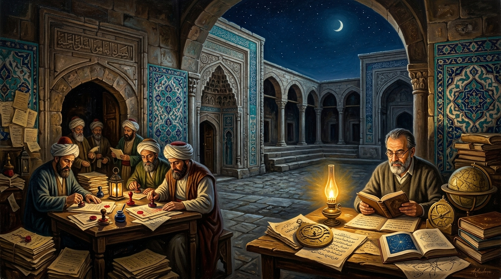
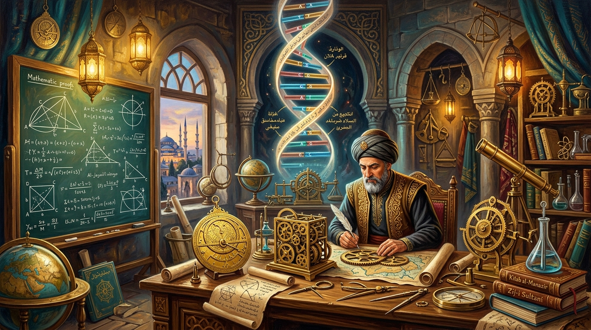
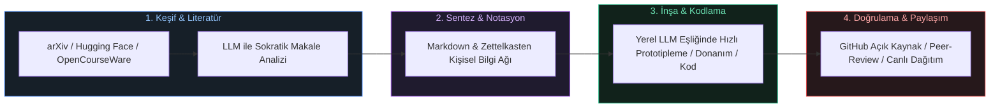

# İdrakin Deli Gömleği: Üniversite, Tecessüsün Katli ve Teslimiyet Senedi

<p align="center">
  
</p>

<p align="center">
  <a href="./MANIFESTO.md"></a>
  <a href="./index.html"></a>
  <a href="https://creativecommons.org/licenses/by-nc-sa/4.0/"></a>
  <a href="./LITERATURE.md"></a>
</p>

> *"İzm'ler idrakimize giydirilen deli gömlekleri. İtibari, samimi olmayan tabular. Kollarımızı bağlayan, bizi birbirimize düşman eden mefhumlar. Düşünceye vurulan zincirler."*  
> — **Cemil Meriç, *Bu Ülke***

> *"Mektep, insanı kendi fıtratına yabancılaştıran, ruhu öldürüp yerine diplomayı ikame eden bir bezirgânlık haline gelmiştir. Hakiki mektep unvan dağıtan değil, hakikate sevdalı şahsiyetler yoğuran ocaktır."*  
> — **Nurettin Topçu, *Türkiye'nin Maarif Davası***

---

## 📑 Ansiklopedik ve Genişletilmiş İçindekiler

- [Mesele: Mabedin Çöküşü ve Kurumsallaşan Zihinsel Esaret](#mesele-mabedin-çöküşü-ve-kurumsallaşan-zihinsel-esaret)
- [I. Teslimiyet Senedi Olarak Diploma: İtaatin Belgesi](#i-teslimiyet-senedi-olarak-diploma-itaatin-belgesi)
- [II. Kürsü Derebeyliği ve Hakikatin Maaşa İpoteklenmesi](#ii-kürsü-derebeyliği-ve-hakikatin-maaşa-ipoteklenmesi)
- [III. Maarifin İflası: Sararmış Notlar, Taş Mektep ve Not Terörü](#iii-maarifin-iflası-sararmış-notlar-taş-mektep-ve-not-terörü)
- [IV. Dil ve Jargon Tahakkümü: Anlaşılmazlığın Arkasına Saklanan Cehalet](#iv-dil-ve-jargon-tahakkümü-anlaşılmazlığın-arkasına-saklanan-cehalet)
- [V. Feynman'ın Aynası: Ezberleyen Fakat Anlamayan Kargo Kültü Bilimi](#v-feynmanın-aynası-ezberleyen-fakat-anlamayan-kargo-kültü-bilimi)
- [VI. Erginleşememe Prangası ve Fabrika Tipi Standartlaştırma](#vi-erginleşememe-prangası-ve-fabrika-tipi-standartlaştırma)
- [VII. Tarihten Günümüze Medrese & Amfi Krizleri: Ali Kuşçu'dan 1933 Reformuna](#vii-tarihten-günümüze-medrese--amfi-krizleri-ali-kuşçudan-1933-reformuna)
- [VIII. Milli Bilim Mirası: Cezeri'den Cahit Arf ve Aziz Sancar'a](#viii-milli-bilim-mirası-cezeriden-cahit-arf-ve-aziz-sancara)
- [IX. Akademik Yağmacılık, Metrik Putu ve H-Index Fetişizmi](#ix-akademik-yağmacılık-metrik-putu-ve-h-index-fetişizmi)
- [X. İntihal Salgını ve "Tercüme Odası" Akademisyenliği](#x-intihal-salgını-ve-tercüme-odası-akademisyenliği)
- [XI. Emek Gasbı ve Asistan Sömürüsü: Bilginin Zoraki Mülkiyeti](#xi-emek-gasbı-ve-asistan-sömürüsü-bilginin-zoraki-mülkiyeti)
- [XII. Epistemolojik Körlük: Metodoloji Putu ve Feyerabend'ın İtirazı](#xii-epistemolojik-körlük-metodoloji-putu-ve-feyerabendın-itirazı)
- [XIII. "Derisi Masada Olmayanlar": Riski Başkasına Yıkan Parazitlik](#xiii-derisi-masada-olmayanlar-riski-başkasına-yıkan-parazitlik)
- [XIV. Düşüncesizliğin Banalitesi: Bürokratik Memurlaşma ve Vicdan Felci](#xiv-düşüncesizliğin-banalitesi-bürokratik-memurlaşma-ve-vicdan-felci)
- [XV. Sosyal Tahliye Vanaları: Öfkenin Sönümlenmesi ve Sahte Çıkışlar](#xv-sosyal-tahliye-vanaları-öfkenin-sönümlenmesi-ve-sahte-çıkışlar)
- [XVI. İstikbal Göklerdedir: Amfilerden Sonsuz Kızıl Elma Ufkuna](#xvi-istikbal-göklerdedir-amfilerden-sonsuz-kızıl-elma-ufkuna)
- [XVII. Otonom Polimatlar Panteonu ve Tarihi Vaka Analizleri](#xvii-otonom-polimatlar-panteonu-ve-tarihi-vaka-analizleri)
- [XVIII. Milli Teknoloji Hamlesi & Dijital Agora: Yerli ve Bağımsız Üretim](#xviii-milli-teknoloji-hamlesi--dijital-agora-yerli-ve-bağımsız-üretim)
- [XIX. Tersine Mühendislik ve "Hacking" Kültürü: İdrakin Pratik İlacı](#xix-tersine-mühendislik-ve-hacking-kültürü-idrakin-pratik-ilacı)
- [XX. Açık Donanım ve Garaj Laboratuvarları: Fiziksel Dünyada Amfisiz İnşa](#xx-açık-donanım-ve-garaj-laboratuvarları-fiziksel-dünyada-amfisiz-inşa)
- [XXI. Yapay Zekâ Çağında Otonom Polimat İnşa Kılavuzu & Meta-Learning](#xxi-yapay-zekâ-çağında-otonom-polimat-inşa-kılavuzu--meta-learning)
- [XXII. Günlük 7 Otonom İnşa Disiplini](#xxii-günlük-7-otonom-inşa-disiplini)
- [XXIII. Özgür Zihnin Yol Haritası: 12 Sarsılmaz İlke](#xxiii-özgür-zihnin-yol-haritası-12-sarsılmaz-ilke)
- [XXIV. Büyük Zihinlerin Amfi ve Bürokrasi İtirazları Koleksiyonu](#xxiv-büyük-zihinlerin-amfi-ve-bürokrasi-itirazları-koleksiyonu)
- [XXV. Akademik İkiyüzlülük Sözlüğü (Jargon Dekoderi)](#xxv-akademik-ikiyüzlülük-sözlüğü-jargon-dekoderi)
- [XXVI. Kavramsal Karşılaştırma Matrisi](#xxvi-kavramsal-karşılaştırma-matrisi)
- [XXVII. Felsefi, Sosyolojik ve Bilimsel Literatür Kaynakçası](#xxvii-felsefi-sosyolojik-ve-bilimsel-literatür-kaynakçası)

---

```mermaid
flowchart TD
    subgraph Geleneksel Akademi ["🏰 Geleneksel Bürokrasi & Kast Düzeni"]
        A[Merak & Tecessüs ile Giren Genç Zihin] --> B[Sararmış Notlar & Kargo Kültü Ezberi]
        B --> C[Keyfi Notlandırma & Disiplinci Sınav Ayini]
        C --> D{Kritik Kavşak}
        D -- "İtiraz & Bağımsız Düşünce" --> E[Mobbing, Yalıtım, Tersine Doğal Seçilim]
        D -- "Uysallaşma & Biat" --> F[Teslimiyet Senedi: Diploma / Memuriyet]
        E --> G[Beyin Göçü / Sessiz Terk / Tükenmişlik]
    end

    subgraph Otonom Üretim ["⚡ Milli Teknoloji & İcazetsiz Üretim"]
        H[Milli Tecessüs & İnşa İradesi] --> I[Global Açık Arşivler, LLM, Milli Tezgâh & Laboratuvar]
        I --> J[Doğrudan Üretim: İHA/SİHA, Kod, Donanım, Makale, Prototip]
        J --> K[Skin in the Game: Gerçek Dünya Testi & Bağımsız Doğrulama]
        K --> L[İstikbal Göklerdedir: Hür ve Otonom Türk Dehası]
    end

    style Geleneksel Akademi fill:#1a161f,stroke:#ef4444,stroke-width:2px,color:#fca5a5
    style Otonom Üretim fill:#0e2019,stroke:#10b981,stroke-width:2px,color:#6ee7b7
```

---

### Mesele: Mabedin Çöküşü ve Kurumsallaşan Zihinsel Esaret

İnsan idrakinin en saf, en ele avuca sığmaz itici gücü **tecessüstür**; yani hakikati arama iştiyakı, doymak bilmez bir anlama, sökme ve sıfırdan inşa etme arzusu. Bu arzu doğası gereği serazattır; sınır tanımaz, hiçbir kalıba sığmaz, ne bir binanın harcına hapsedilebilir ne de vizelerin ve finallerin dar takvimine. 

Oysa modern dünya, hakikatin bu vahşi ve kuralsız nehrini ıslah etmek, onu ehlileştirip devlet aygıtının ve sermayenin dişlilerine uyumlu hale getirmek için adına "akademi" denen devasa mabetler inşa etmiştir. Karl Jaspers'ın *Üniversite İdesi* eserinde uyardığı gibi:

> *"Üniversite, hakikatin koşulsuz arandığı bir cemaat olmaktan çıkıp devletin memur ihtiyacını karşılayan bir meslek okuluna veya bürokratik bir aygıta dönüştüğünde kendi ruhunu katleder. Hakikat arayışı kurumsal mekanizmaların emrine verilemez."*  
> — **Karl Jaspers, *Die Idee der Universität***

Cemil Meriç, zihni donduran ithal fikir şablonlarına *"idrake giydirilen deli gömlekleri"* teşhisini koyarken meseleyi salt ideolojik bir körleşme olarak ele alıyordu. Oysa bugün o gömlek, soyut mefhumların sınırlarını aşmış; amfileri, sararmış ders notları, kürsü derebeylikleri ve bürokratik ceza zırhlarıyla **bizatihi modern üniversitenin fiziksel ve kurumsal mimarisine dönüşmüştür.**

Bir alana derin bir merakla, üretme ateşiyle giren bir genç dimağ; üniversite kapısından adım attığı anda hakikatin agorasını değil, ortaçağ lonca sisteminin bürokratik devlet memurluğuyla tahkim edilmiş modern bir karikatürünü bulur. Kendi merakının peşinden gitmek isteyen zihin, sistemin mengenesinde un ufak edilir; heyecan yerini bürokratik yılgınlığa, üretim aşkı ise itaat talimlerine bırakır.

Sezai Karakoç, üniversitenin bu çoraklaşmasını ve ruhunu yitirişini şu veciz feryatla dile getirir:

> *"Üniversite, bir hakikat arayışı ve ruh çilesi olmaktan çıkmış; kartvizit dağıtan, unvan fetişizmini besleyen ve zihni memurlaştıran soğuk bir bürokrasi kalesine dönmüştür. Hakiki diriliş, amfilerin mermerlerine değil, hakikatin çilesine talip olmakla başlar."*  
> — **Sezai Karakoç, *Diriliş Neslinin Âmentüsü***

---

### I. Teslimiyet Senedi Olarak Diploma: İtaatin Belgesi

Toplumsal yanılsama, üniversite diplomasını bir bilgi, liyakat ve erginleşme ehliyeti zanneder. Oysa üniversite fabrikasının banttan indirdiği ürün bilgi değil, uysallaştırılmış memurdur.

> **Diploma, bireye verilen bir ehliyet değil; sistemin onayından geçtiğini, sivriliklerinin törpülendiğini ve uysallaştırıldığını tescilleyen bir teslimiyet senedidir.**

Dört veya beş yıl boyunca bir amfide tescillenen şey zihinsel derinlik değildir:
* Saçma ve çağdışı bir bürokrasiye ses çıkarmadan tahammül edebilme kapasitesi,
* Hocanın bariz cehaletini ve hatalarını yüzüne vurmayacak kadar kendini sansürleme becerisi,
* Anlamsız bir ezberi sınav kâğıdına kusup kapıdan çıktığı an unutmayı kabulleniş,
* Kendi özgün metodolojisini çöpe atıp "kürsünün istediği şablonu" taklit etme ikiyüzlülüğü.

Altına atılan rektör ve dekan imzalarının arkasındaki gizli metin şudur: *"Bu birey artık tehlikesizdir. Köşeleri zımparalanmış, merakı hadım edilmiş, sisteme memur olmaya hazır hale getirilmiştir."* Eğer bir insanın sivrilikleri törpülenmemişse, o diploma ya hiç verilmez ya da o kişi orayı terk etmek zorunda kalır. Çünkü köşe, çarkı bozar; sistem ise sadece pürüzsüz yuvarlanan dişlilerle döner.

> *"Okullaşmış toplumda bilgi bir meta, diploma ise o metanın tekelini elinde tutan loncanın şantaj aracıdır. İnsanlar öğrenme yetilerini okullara devrettikçe kendi meraklarına yabancılaşır ve kurumların sunduğu paket programlar dışında hiçbir şey yapamayacaklarına inandırılırlar."*  
> — **Ivan Illich, *Okulsuz Toplum***

İsmet Özel ise modern diploma fetişizmini ve kurumsal yabancılaşmayı şu keskin ifadelerle teşhis eder:

> *"Diploma, modern insanın efendisine gösterdiği kölelik beratıdır. İnsanlar bir kâğıt parçası uğruna haysiyetlerini, meraklarını ve şahsiyetlerini amfilerin kapısında bırakırlar."*  
> — **İsmet Özel, *Üç Mesele***

---

### II. Kürsü Derebeyliği ve Hakikatin Maaşa İpoteklenmesi

Akademi, bilgi üretiminin ve hür tefekkürün kalesi olduğu iddiasıyla meşruiyet devşirir; oysa gerçekte unvan tüccarlarının ve konfor alanı bekçilerinin patrimonyal mülküdür. Arthur Schopenhauer, ta 19. yüzyılda bu sahte kutsallığın maskesini acımasızca indirmiştir:

> *"Hakikati aramakla değil, devletten alacağı maaşla ve kürsüdeki koltuğuyla ilgilenen unvan sahipleri felsefeyi ve bilimi boğar. Üniversite felsefesi, hakikatin değil; geçim derdinin, itibar avcılığının ve bakanlıkların talimatlarının hizmetindedir. Hakikat ise tehlikelidir, rahat bozar; bu yüzden üniversite kürsülerine asla yaklaştırılmaz."*  
> — **Arthur Schopenhauer, *Üniversite Felsefesi Üzerine***

Üniversite hocası, kürsüsünü bir araştırma tezgâhı değil, ferman dağıttığı feodal bir tımar arazisi olarak görür. Kendisine soru sorulmasını cehaletine yöneltilmiş bir tecavüz, literatürün güncel halinin hatırlatılmasını ise "hocalık onuruna hakaret" sayar. Celal Şengör'ün şu tespiti, bu toprakların amfilerindeki değişmez trajediyi doğrudan yüzümüze çarpar:

> *"Bizde üniversite hocası kendini yarı-tanrı zanneder. Odasına girerken titrersin, soru sorarsan düşman beller. Bu kafa feodal kabile reisliği kafasıdır. Bu kafayla dünya çapında tek bir bilim insanı yetiştiremezsin; yetiştiklerini de Batı'ya kaçırırsın."*  
> — **Prof. Dr. A. M. Celal Şengör**

Bilgi, bu feodal beyliklerde bir keşif vasıtası olmaktan çıkarılıp tahakküm aparatına dönüştürülür. Edward Said'in bağımsız aydın tanımı ile üniversite koridorlarında karşılaşılan memur tipi arasındaki derin uçurum tam olarak buradadır:

> *"Entelektüel, iktidara karşı doğruyu söyleyen, uzlaşmaz, koro halinde şarkı söylemeyi reddeden kişidir. Oysa profesyonel akademisyen; uzmanlık alanı adı verilen daracık bir çite hapsolmuş, fon sağlayıcıları ve idareyi ürkütmekten ödü kopan bir unvan bekçisidir."*  
> — **Edward Said, *Entelektüel: Sürgün, Marjinal, Yabancı***

---

### III. Maarifin İflası: Sararmış Notlar, Taş Mektep ve Not Terörü

<p align="center">
  
</p>

Üniversite amfisi ve sınav salonu, nesnel bilginin ölçüldüğü tarafsız alanlar değildir. Michel Foucault'nun hapishane, kışla ve hastane üçgeninde analiz ettiği disiplinci iktidarın en rafine uygulama sahalarıdır.

> *"Disiplinci iktidar, bireyleri uysal bedenler haline getirmek için çalışır. Sınav ritüeli bu uysallaştırmanın doruk noktasıdır; bireyi sürekli bir gözetim, kayıt ve hiyerarşik sınıflandırma mekanizmasına hapseder. Sınavda amaç bilginin derinliği değil; iktidarın normuna ne kadar kusursuz uyulduğunun denetlenmesidir."*  
> — **Michel Foucault, *Hapishanenin Doğuşu***

Nurettin Topçu'nun *Türkiye'nin Maarif Davası*nda haykırdığı gibi:

> *"Mektep diploma tüccarlığına, amfiler memur kışlasına dönmüştür. Hakiki muallim talebesine unvan değil şahsiyet aşılar; talebesinin zihnini sararmış notlara değil kâinatın sırlarına açar. Ruhsuz bilgi kalbi taşlaştırır, zihni köleleştirir."*  
> — **Nurettin Topçu**

Paulo Freire'nin "bankacı eğitim modeli" tam bu noktada işler: Öğrenci, hocanın 25 yıl önce daktiloyla yazılmış ders notlarındaki bariz bir hatayı dahi düzeltemez; çünkü o hatayı papağan gibi tekrarlamak sınavdan geçmenin, itiraz edip doğrusunu göstermek ise dersten kalmanın mutlak garantisidir. Birey, aklını kürsünün cehaletine teslim ettiği ölçüde "başarılı" ilan edilir.

---

### IV. Dil ve Jargon Tahakkümü: Anlaşılmazlığın Arkasına Saklanan Cehalet

Akademik zümre, kendi kısırlığını ve fikir fukaralığını gizlemek için adına "akademik dil" dediği yapay, ağdalı ve anlaşılmaz bir jargon şatosu inşa eder. Basit bir gerçeği herkesin anlayabileceği durulukta söylemek, akademinin sahte büyücülük tekeline tehdit sayılır.

George Orwell, *Siyaset ve İngiliz Dili* denemesinde bu durumu şöyle teşhir eder:

> *"Akademik ve bürokratik jargon, düşünceyi derinleştirmek için değil; saçmalığı saygın göstermek, yalanı hakikat kılığına sokmak ve boşluğa sağlamlık süsü vermek için icat edilmiştir."*  
> — **George Orwell, *Politics and the English Language***

Arthur Schopenhauer ise bu sahte bilgeliği şu tokat gibi sözlerle yerin dibine batırır:

> *"Açık düşünen insan açık yazar. Bulanık, anlaşılmaz ve ağdalı yazanlar ise aslında kafalarında ne olduğunu kendileri de bilmeyen şarlatanlardır. Bir fikri derin göstermenin en ucuz yolu, onu anlaşılmaz kılmaktır."*  
> — **Arthur Schopenhauer, *Yazarlık ve Üslup Üzerine***

---

### V. Feynman'ın Aynası: Ezberleyen Fakat Anlamayan Kargo Kültü Bilimi

Nobel Fizik Ödüllü Richard Feynman, ezberci akademi dünyasını sarsan şu tarihî teşhisi koyar:

> *"Öğrencilerin her şeyi harfiyen ezberlediğini gördüm. Kitaptaki formülleri ezbere okuyor, sınav sorularına kitaptaki cümlelerle kusursuz yanıtlar veriyorlardı. Ama onlara doğadan somut tek bir örnek sorduğumda, ışığın bir aynaya veya suya çarptığında ne yaptığını sorduğumda tam bir sessizlik oluyordu! Hiçbir şey anlamamışlardı. Sadece kelimeleri ve sembolleri papağan gibi ezberlemişlerdi. Bu bilim değil; bilimin taklididir, bir kargo kültüdür."*  
> — **Richard Feynman, *Surely You're Joking, Mr. Feynman!***

Modern üniversite, kavramların özünü ve inşa etme kudretini kavrayan zihinler değil; soruların formatını ezberleyen "optik form memurları" yetiştirir. Ali Şeriati bu duruma "öğretilmiş cehalet" adını verir:

> *"Öğretilmiş cehalet, bilmeyen insanın cehaletinden bin kat daha tehlikelidir. Çünkü diplomalı cahil, bildiğini zannettiği için hakikati aramayı bütünüyle bırakmıştır."*  
> — **Ali Şeriati, *Kendini Devrimci Yetiştirmek***

---

### VI. Erginleşememe Prangası ve Fabrika Tipi Standartlaştırma

Immanuel Kant, aydınlanmayı bir hürriyet manifestosu olarak sunarken, insanın kendi aklını başkalarının rehberliği olmadan kullanamayışını "ergin olmama hali" olarak tarif ediyordu:

> *"Aydınlanma; insanın kendi suçu ile düşmüş olduğu bir ergin olmama durumundan kurtulmasıdır. Bu ergin olmayış durumu ise, insanın kendi aklını bir başkasının kılavuzluğuna başvurmaksızın kullanamayışıdır. Sapere Aude! Kendi aklını kullanma cesaretini göster!"*  
> — **Immanuel Kant, *Aydınlanma Nedir?***

Oysa üniversite, öğrenciye sistematik olarak şunu fısıldar: *"Sen tek başına düşünemezsin. Sen kendi metodolojini kuramazsın. Sen bizim icazetimiz ve tasdikimiz olmadan konuşamazsın."* Friedrich Nietzsche ise üniversitelerin devasa birer memur imalat bandı olduğunu çok önceden teşhis etmiştir:

> *"Mevcut yükseköğretim kurumları dehanın değil, faydalı ve itaatkâr memurların yetiştirilmesini hedefler. Eğitimin yaygınlaştırılması ve standartlaştırılması el ele gider; amaç, tek tek bireyleri tek tip tornadan geçirerek devlet çarkının uysal birer dişlisi haline getirmektir."*  
> — **Friedrich Nietzsche, *Eğitim Kurumlarımızın Geleceği Üzerine***

Bertrand Russell ise modern eğitimin nasıl itaate programlandığını şu sözlerle deşifre eder:

> *"Eğitim sistemi bilgi aşılamak için değil, otoriteye itaat edecek ve kurulu nizamı asla sorgulamayacak uysal kitleler imal etmek için dizayn edilmiştir."*  
> — **Bertrand Russell, *Education and the Social Order***

---

### VII. Tarihten Günümüze Medrese & Amfi Krizleri: Ali Kuşçu'dan 1933 Reformuna

Türkiye'de bilgi üretiminin kurumsal prangalarla boğulması dün başlamamıştır. Tarih, hakiki tecessüsün bürokratik taassupla çatışmasının ibretlik sahneleriyle doludur:

1. **Sahn-ı Seman ve Ali Kuşçu'nun Altın Çağı:** Fatih Sultan Mehmed, Semerkand'ın büyük matematikçi ve astronomu Ali Kuşçu'yu İstanbul'a davet ederek medreseleri matematik ve astronomi temeline oturtmuştu. Hakikat arayışı ve hendese el üstündeydi.
2. **1580 İstanbul Rasathanesi'nin Yıktırılması Trajedisi:** Takiyüddin er-Râsıd'ın kurduğu ve Tycho Brahe'nin rasathanesinden daha üstün aletlerle donatılmış Tophane Rasathanesi; Şeyhülislam Kadızade'nin *"Gökleri gözetlemek uğursuzluk getirir"* fetvasıyla Kaptan-ı Derya Kılıç Ali Paşa'nın gemilerinden atılan top atışlarıyla yerle bir edildi. Bu top atışları, Doğu'nun bilimsel idrakine vurulan en ağır deli gömleğiydi.
3. **Kâtip Çelebi'nin Feryadı:** 17. yüzyılda Kâtip Çelebi *Mîzânü'l-Hakk*'ta, medreselerden mantık ve riyaziye (matematik) derslerinin kaldırılmasıyla ilmin yerini dedikodu ve taassubun aldığını acıyla kaydetti.
4. **1933 Üniversite Reformu ve Darülfünun Tasfiyesi:** İsviçreli pedagog Prof. Albert Malche'nin raporuyla Darülfünun lağvedildi. Rapor; hocaların yabancı dil bilmediğini, sararmış notları papağan gibi tekrarladığını ve dünya literatüründen bütünüyle koptuğunu belgeliyordu. 

Bu tarihi döngü göstermektedir ki; kurumlar değişse de (Medrese -> Darülfünun -> Üniversite), bürokratik zihniyet tecessüsü boğma reflexini daima korumuştur.

---

### VIII. Milli Bilim Mirası: Cezeri'den Cahit Arf ve Aziz Sancar'a

<p align="center">
  
</p>

Bu topraklar; amfilerin bürokratik vesayetine sığmayan, bizzat tezgâhında üreten devasa bir bilim ve inşa mirasına sahiptir:

* **Bedîüzzaman el-Cezeri (1136–1206):** Saray bürokrasisine boyun eğmeden, Artuklu diyarında hidrolik otomatları, çift etkili emme basma tulumbalarını, krank millerini ve su saatlerini bizzat elleriyle inşa etti; sibernetiğin ve robotik mühendisliğin kurucusu oldu. *"Uygulamaya dökülmeyen her bilgi doğru ile yanlış arasında asılı kalır"* diyerek amfi teorisyenliğine 800 yıl önceden tokat attı.
* **Kâtip Çelebi (1609–1657):** *Mîzânü'l-Hakk* eserinde medreselerden aklî ve riyâzî ilimlerin kaldırılmasını Şark'ın felaketi olarak teşhis etti; taassup ve cehalet zincirlerine karşı aklın hürriyetini savundu.
* **Ord. Prof. Dr. Cahit Arf (1910–1997):** *"Üniversite, hocanın dediklerinden şüphe duyup daha doğrusunu arayanların yeridir"* diyerek Arf Değişmezi, Arf Halkaları ve Arf Kapanışları ile dünya matematik literatürüne silinmez bir mühür vurdu.
* **Prof. Dr. Oktay Sinanoğlu (1935–2019):** *"Türkiye'de üniversiteler feodal beylikler haline getirilmiştir. Deha bu çarkı kırandır"* diyerek Yale Üniversitesi'nde 26 yaşında 20. yüzyılın en genç tam profesörü oldu; atom ve moleküllerin çoklu elektron teorisini tek başına kurdu.
* **Prof. Dr. Aziz Sancar:** *"Bana Amerika'da 'Sen kimsin, hocana nasıl karşı çıkarsın?' demediler; 'Ne buldun, teorin ne?' dediler. Liyakat olan yerde bilim yeşerir; liyakat olmayan yerde sadece dalkavukluk yeşerir"* diyerek Nobel Kimya Ödülü'ne uzandı.

---

### IX. Akademik Yağmacılık, Metrik Putu ve H-Index Fetişizmi

21. yüzyıl üniversitesi, hakikat arayışını bütünüyle terk ederek adına "akademik teşvik" denen bir puan avcılığına teslim olmuştur. 

Goodhart Yasası burada kusursuz biçimde işler: **"Bir metrik bir hedef haline geldiğinde, iyi bir metrik olmaktan çıkar."**

1. **Paralı Yağmacı Dergiler (*Predatory Journals*):** 300-500 dolar karşılığında hakem sürecini 3 günde tamamlayıp hiçbir bilimsel değeri olmayan çöp metinleri yayınlayan dergilerle unvan toplayan bir profesör ordusu türemiştir.
2. **Atıf Çeteleri (*Citation Cartels*):** Kürsü üyeleri, birbirlerinin hiçbir işe yaramayan makalelerine zoraki atıflar yaparak H-index puanlarını yapay olarak şişirir; liyakatli genç araştırmacıların önünü bu kartellerle keserler.
3. **Makale Dilimleme (*Salami Slicing*):** Tek bir anlamlı deney veya algoritma, 5 farklı parçaya bölünerek 5 ayrı yayın gibi sunulur. Amaç bilime katkı değil, rektörlük teşvik puanını maksimize etmektir.

---

### X. İntihal Salgını ve "Tercüme Odası" Akademisyenliği

Kendi medeniyetine, kendi diline ve özgün tecessüsüne yabancılaşmış müstağrip akademisyen profili; bilim üretmeyi Batı'daki makaleleri kötü bir Türkçeyle kopyalayıp amfi kürsüsünden okumak zanneder.

Cemil Meriç bu trajediye *"Tercüme Odası Entelektüeli"* adını verir:

> *"Kendi semamızın yıldızlarına gözlerini kapayıp Batı'nın sönük lambalarına pervanelik edenler, bu millete kılavuzluk edemezler. Düşünce tercüme edilemez; tefekkür bizzat kendi toprağında, kendi diliyle ve kendi sancısıyla doğar."*  
> — **Cemil Meriç, *Umrandan Uygarlığa***

Bugün tez merkezlerinde parayla yazdırılan yüksek lisans ve doktora tezleri, intihal tespit yazılımlarının arkasından dolanmak için eşanlamlı kelimelerle takla attırılan kopyala-yapıştır metinler; amfilerin bilimi değil, diplomalı sahtekârlığı kurumsallaştırdığının en somut kanıtıdır.

---

### XI. Emek Gasbı ve Asistan Sömürüsü: Bilginin Zoraki Mülkiyeti

Karl Marx'ın 1844 Elyazmaları'nda bahsettiği emek yabancılaşması, akademide araştırma görevlisinin, asistanın ve lisansüstü öğrencisinin sırtında somutlaşır.

Genç araştırmacının gecesini gündüzüne katarak yazdığı tez, modellediği algoritma veya laboratuvarda haftalarca nöbet tutarak elde ettiği bulgular; kürsü sahibinin zoraki yazarlığıyla (*coercive/gift authorship*) gasbedilir. Emekçisi olduğu bilginin üzerinde genç zihne hiçbir mülkiyet hakkı bırakılmaz. 

Kürsü sahibi tek bir satırını dahi okumadığı makalenin ilk veya sorumlu yazarı (*corresponding author*) olurken, asistan dipnotta teşekkür edilen bir köleden farksızdır. Bilimsel üretim, unvan sahiplerinin akademik teşvik ve puan toplama yarışında harcanan bir hammaddeye indirgenmiştir.

---

### XII. Epistemolojik Körlük: Metodoloji Putu ve Feyerabend'ın İtirazı

Akademi, araştırmacının önüne "kabul edilebilir tek yöntem" olarak katı, ruhsuz ve bürokratik bir metodoloji şablonu koyar. Bu şablon dışına çıkan her özgün fikir "bilim dışı" ilan edilir. Bilim felsefecisi Paul Feyerabend, bu metodoloji putunu *Yönteme Karşı* eserinde paramparça eder:

> *"Bilim tarihi göstermektedir ki, en büyük keşifler yerleşik yöntem kuralları çiğnendiğinde yapılmıştır. Bilime tek bir yöntem dayatmak, aklı hadım etmektir. Tek geçerli ilke vardır: Her şey uyar (Anything goes)!"*  
> — **Paul Feyerabend, *Against Method***

Gaston Bachelard ise akademik alışkanlıkların nasıl birer zihinsel duvara dönüştüğünü şöyle özetler:

> *"Bilimsel zihnin oluşumunda en büyük engel bilgisizlik değil; yerleşik ve kutsanmış eski bilgilerdir. Hakiki ilim, geçmişin tabularını yıkma cesaretidir."*  
> — **Gaston Bachelard, *Bilimsel Zihnin Oluşumu***

---

### XIII. "Derisi Masada Olmayanlar": Riski Başkasına Yıkan Parazitlik

Nassim Nicholas Taleb, *Skin in the Game (Derini Ortaya Koymak)* ve *Antifragile* eserlerinde modern akademisyenin en can alıcı zafiyetini yüzüne vurur:

> *"Bir teoriyi ortaya atan ama o teorinin çöküşünden hiçbir bedel ödemeyen, risk almayan (no skin in the game) akademisyenin fikirleri değersizdir. Pratikte hiçbir sistem inşa etmemiş, piyasada iflas etme riski almamış, laboratuvar tezgâhında donanım yakmamış unvan sahipleri; bedelini başkalarının ödediği sahte bir bilgelik satarlar."*  
> — **Nassim Nicholas Taleb, *Skin in the Game***

Kürsü sahibi, makalesinde savunduğu hatalı ekonomi modelinin veya verimsiz algoritmanın faturasını asla ödemez; faturayı işsiz kalan mezunlar ve kaynakları heba olan toplum öder.

---

### XIV. Düşüncesizliğin Banalitesi: Bürokratik Memurlaşma ve Vicdan Felci

Hannah Arendt'in Eichmann davasında analiz ettiği *"Kötülüğün Banalitesi"*, amfilerde ve dekanlık koridorlarında "Düşüncesizliğin Banalitesi" olarak tezahür eder:

> *"Kötülük her zaman canavarca bir niyetten doğmaz; çoğu zaman sadece kurallara harfiyen uyan, kendi aklıyla düşünmeyi ve vicdani sorgulamayı bırakmış sıradan bürokratların elinde sıradanlaşır."*  
> — **Hannah Arendt, *Eichmann Kudüs'te: Kötülüğün Sıradanlığı***

Öğrenciye sıfır veren, baremsiz sınavlarla gençlerin geleceğini karartan, mobbing uygulayan öğretim görevlisi kendini savunurken *"Ben sadece yönetmeliği uyguluyorum"* der. Düşünce ve vicdan askıya alınmış, rektörlük kararnamesi ahlakın yerine ikame edilmiştir.

---

### XV. Sosyal Tahliye Vanaları: Öfkenin Sönümlenmesi ve Sahte Çıkışlar

Bu denli katı bir güç asimetrisi, baremsiz sınavlar, keyfi notlandırma ve mobbing altında normal şartlarda kampüslerin her dönem kitlesel boykotlarla sarsılması gerekirdi. Peki Türk üniversitelerinde neden yaprak dahi kımıldamaz?

Bu sorunun cevabı, Byung-Chul Han'ın modern psikopolitika kuramında ve bürokratik mekanizmanın geliştirdiği "emniyet vanalarında" gizlidir:

> *"Bugün iktidar bedensel şiddet uygulamaz; bireyi kendi yetersizliğine inandırarak sömürür. Birey, sistemin kurbanı olduğunu fark edemez; başarısızlığı kendi kişisel eksikliği zanneder, depresyona girer ve enerjisini içe doğru patlatır."*  
> — **Byung-Chul Han, *Psikopolitika***

Bu içselleştirilmiş çaresizliğin üzerine inşa edilen **4 Büyük Tahliye Vanası**, biriken öfkeyi atomize ederek buharlaştırır:

1. **Açıköğretim (AÖF / AUZEF) Kaçış Koridoru:**  
   Hocanın kaprisine ve keyfi notlandırmasına takılan öğrenci, sınavları bilgisayar tarafından okunan, insan faktörünün ve şahsi egonun sıfırlandığı optik forma sığınır. Askerliğini tecil ettirir, diplomasını alır; fakat kürsüyle ve haksızlıkla hesaplaşmaktan bütünüyle vazgeçer.
2. **KYK Kredisi ve Yurt Tamponu:**  
   Okul uzasa dahi bursun krediye dönüşerek yatması ve barınmanın sağlanması, öğrencinin sokakta kalıp çıplak bir varoluş krizine girmesini engeller. Açlık tamponlanır, isyan potansiyeli yerini uyuşuk bir kabullenişe bırakır.
3. **Ek Madde 1 (Merkezi Puanla Yatay Geçiş):**  
   Hocasının hışmına uğrayan öğrenciye, kimseden izin almadan merkezi sınav puanıyla başka bir üniversiteye sessizce firar etme imkânı sunulur. Sorun çözülmez, hesap sorulmaz; sadece coğrafi olarak ötelenir.
4. **Periyodik Genel Öğrenci Afları:**  
   Birkaç yılda bir çıkarılan genel öğrenci afları, *"Nasılsa af çıkar, bir şekilde bitiririm"* rehaveti yaratarak hukuki itiraz ve kolektif direnç refleksini uyuşturur.

Öfke örgütlenemez; bireyselleşir, sisteme zarar vermeden sessiz terklerle ve istifalarla havaya karışır.

---

### XVI. İstikbal Göklerdedir: Amfilerden Sonsuz Kızıl Elma Ufkuna

<p align="center">
  
</p>

Hakiki ilim, hiçbir zaman amfi derebeylerinin inayetine veya unvan tüccarlarının icazetine muhtaç olmamıştır. Jacques Derrida'nın "Koşulsuz Üniversite" ütopyasında tarif ettiği bağımsız hakikat arayışı, amfilerin mermer duvarlarına kurban edilemez:

> *"Koşulsuz üniversite, hiçbir dogma ve iktidar odağına bağlı olmaksızın hakikati söyleme ve sorgulama hakkını talep eder. Üniversite bu koşulsuz özgürlüğü kaybettiği anda sadece bürokrasinin bir uzantısı haline gelir."*  
> — **Jacques Derrida, *Koşulsuz Üniversite***

Mustafa Kemal Atatürk'ün *"İstikbal göklerdedir"* şiarı; Türk gençliğinin amfi vesayetini yırtıp semalara, uzaya ve bağımsız yüksek teknolojiye yürümesini emreder.

---

### XVII. Otonom Polimatlar Panteonu ve Tarihi Vaka Analizleri

İnsanlık ve Türkiye tarihinin en büyük atılımları, amfilerin konfor alanında değil; bizzat tezgâh başında bedel ödeyen otonom dehaların ellerinde doğmuştur:

```
┌─────────────────────────────────────────────────────────────────────────────┐
│                       OTONOM DEHALARIN TARİHİ ÇİZGİSİ                       │
├──────────────────────┬────────────────────────┬─────────────────────────────┤
│ Şahsiyet             │ Amfi / Akademi Bağı    │ Devrimci Eseri / Mirası     │
├──────────────────────┼────────────────────────┼─────────────────────────────┤
│ El-Cezeri            │ Lonca / Tezgâh         │ Sibernetik, Krank Mili, Robot│
│ Leonardo da Vinci    │ Amfisiz (Harfsiz Adam) │ Anatomi, Helikopter, Resim  │
│ Nikola Tesla         │ Üniversiteyi Terk Etti │ Alternatif Akım (AC), Radyo │
│ Srinivasa Ramanujan  │ Unvansız / Defter      │ Modüler Fonksiyonlar, Seri  │
│ Nuri Demirağ         │ Bürokrasisiz Girişim   │ İlk Yerli Türk Uçağı (Nu.D) │
│ Şakir Zümre          │ İstiklal Sanayicisi    │ İlk Yerli Mühimmat & Bomba  │
│ Aaron Swartz         │ MIT'ye Meydan Okudu    │ RSS, Markdown, Sci-Hub Ruhu │
│ Linus Torvalds       │ Oturma Odası Hacker'ı  │ Linux Çekirdeği, Git        │
│ George Hotz (geohot) │ Garaj / Tersine Müh.   │ iOS Jailbreak, openpilot    │
│ Selçuk Bayraktar     │ Saha / Hangâr Tezgâhı  │ Bayraktar TB2, Akıncı, Kızılelma│
└──────────────────────┴────────────────────────┴─────────────────────────────┘
```

#### Vaka 1: Aaron Swartz ve Bilgiyi Özgürleştirme Savaşı
MIT ve JSTOR'un duvarları arkasına kilitlenen 4.8 milyon akademik makaleyi kamuya açmak için canını ortaya koydu. Bilginin bir avuç tekelci şirketin kâr kapısı yapılmasına karşı manifestosuyla ölümsüzleşti:
> *"Bilgi güçtür. Ancak tüm güçler gibi onu kendilerine saklamak isteyenler vardır. Bilgiyi özgürleştirmek ahlaki bir zorunluluktur."*

#### Vaka 2: Nuri Demirağ ve Şakir Zümre'nin Amfi & Bürokrasiyle İmtihanı
Türkiye'nin ilk yerli uçak fabrikasını kuran Nuri Demirağ ve ilk yerli harp sanayiini kuran Şakir Zümre; yabancı hayranı bürokratların *"Biz yapamayız, dışarıdan alalım"* lobisiyle engellendi. Gerçek üretim aşkı, amfilerin teorik teslimiyetini her zaman aşmıştır.

---

### XVIII. Milli Teknoloji Hamlesi & Dijital Agora: Yerli ve Bağımsız Üretim

<p align="center">
  
</p>

21. yüzyıl Türk mühendisi ve araştırmacısı; amfilerin sararmış notlarına mahkûm değildir. Milli Teknoloji Hamlesi'nin otonom ruhuyla:
* **Havacılık ve Uzayda:** KAAN, Kızılelma, Bayraktar TB3, ANKA ve TÜRKSAT yerli tezgâhlarda tasarlanmaktadır.
* **Yapay Zekâ ve Yazılımda:** Türkçe büyük dil modelleri (LLM), açık kaynaklı derin öğrenme kütüphaneleri ve otonom sistemler global platformlarda paylaşılmaktadır.
* **Açık İlimde:** arXiv, GitHub, Hugging Face ve açık donanım repoları sayesinde dünyanın en ileri araştırmalarına anında erişilip katkı sunulmaktadır.

Artık hakikatin hakemi rektörlük nizamı değil; göklerde uçan milli sistemler, doğrulanan matematiksel teoremler ve açık kaynakta çalışan koddur.

---

### XIX. Tersine Mühendislik ve "Hacking" Kültürü: İdrakin Pratik İlacı

İdrake giydirilen deli gömleğini parçalamanın en etkili pratik yöntemi **Tersine Mühendislik (Reverse Engineering)** ve sahici **Hacking** ahlakıdır.

Steven Levy'nin *Hackers: Heroes of the Computer Revolution* eserinde formüle ettiği Hacker Etiği ilkeleri, akademi dogmatizminin tam panzehiridir:
1. **Bilgiye ve Sistemlere Erişim Sınırsız ve Doğrudan Olmalıdır:** Bir şeyi anlamanın tek yolu onu bizzat sökmek, çalıştırmak ve değiştirmektir.
2. **Tüm Bürokrasiye ve Otoriteye Şüpheyle Yaklaş:** Liyakati diplomalar ve unvanlar değil; ortaya konan çalışan eser belirler.
3. **Kodu ve Eseri Herkesle Paylaş:** Saklanan bilgi çürür; açık kaynakta paylaşılan bilgi kâinatı dönüştürür.

---

### XX. Açık Donanım ve Garaj Laboratuvarları: Fiziksel Dünyada Amfisiz İnşa

Akademik tekel sadece yazılımda değil, laboratuvar donanımlarında da kırılmıştır. Bugün tek bir bağımsız genç:
* **Açık Kaynak Donanım (OSHW):** Arduino, Raspberry Pi, ESP32 ve açık mimarili RISC-V çipleriyle kendi kartını basabilmektedir.
* **Masaüstü Fabrikasyon:** 3D yazıcılar ve masaüstü CNC tezgahlarıyla 50 yıl önce koca bir üniversite enstitüsünün yapamadığı mekanik prototiplemeyi kendi odasında tamamlamaktadır.
* **Açık Bilimsel Cihazlar:** Kendi açık mikroskobunu (Foldscope), elektroensefalografi (OpenBCI) cihazını ve spektrometresini inşa ederek üniversitenin kilitli laboratuvarlarına muhtaç olmadan deneysel bilim yapmaktadır.

---

### XXI. Yapay Zekâ Çağında Otonom Polimat İnşa Kılavuzu & Meta-Learning

Modern çağda tek bir bağımsız araştırmacı veya mühendis; açık kaynaklı yapay zekâ asistanlarıyla donanmış bir **Otonom Polimat (Autonomous Polymath)** haline gelebilir:



#### Feynman Tekniği ile Öğrenme Mimarisi:
1. **Hedef Konuyu Seç:** Bir profesörün ders programına bağlı kalmadan, merak ettiğin temel bir sistemi seç.
2. **10 Yaşındaki Bir Çocuğa Anlatır Gibi Basitleştir:** Jargonun arkasına saklanmadan en yalın haliyle açıkla.
3. **Tıkandığın Noktalarda Orijinal Literatüre Dön:** Anlamadığın yerleri ezberleme; ilk ilkesine (*first principles*) kadar in.
4. **Basitleştir ve Analojilerle İnşa Et:** Kendi zihinsel modelini oluştur ve kodla/donanımla test et.

---

### XXII. Günlük 7 Otonom İnşa Disiplini

1. **Günde 1 Saat Orijinal Mimari ve Kaynak Kod Oku:** Hocanın slaytını değil, Linux çekirdeğini, açık makaleleri veya standart teknik dokümantasyonları oku.
2. **Her Gün 'Proof of Work' Üret:** Git commit'i, lehimlenmiş devre, yazılmış teknik analiz; günü boş geçirme.
3. **Korkusuzca 'Bilmiyorum' De ve İlk İlkelere İn:** Amfi kibriyle sahte bilgelik taslama; bir şeyi atomik gerçekliğine kadar sök.
4. **Sorgulanmamış Hiçbir Otoriteyi Kabul Etme:** Rütbeleri değil, delilleri ve çalışan sistemleri tart.
5. **Kendi Kütüphaneni ve Markdown Not Ağını Canlı Tut:** Bilgiyi unutulacak sınav kâğıdına değil, ömür boyu büyüyecek Zettelkasten ağına yaz.
6. **Milli Köklerine Tutun, Küresel Agoraya Katkı Sun:** Kendi toprağının meselelerini evrensel bilim standartlarıyla çöz.
7. **Bedel Ödemekten ve Hata Yapmaktan Korkma:** Hata sistemin çöküşü değil, keşfin başlangıcıdır.

---

### XXIII. Özgür Zihnin Yol Haritası: 12 Sarsılmaz İlke

1. **İcazet Arama Hastalığından Kurtul:** Üretmek için bir profesörün onayına, bir kürsünün lütfuna ihtiyacın yok.
2. **Kodu ve Eseri Konuştur:** Diplomanın süslü yalanları karşısında en dürüst hakem çalışan açık kaynak kod ve milli üretimdir.
3. **Derini Masaya Koy (Skin in the Game):** Risk alan, inşa eden, test eden ve bedel ödeyen sahici bir üretici ol.
4. **Amfiyi Araçsallaştır:** Üniversitedeysen orayı sadece bir altyapı istasyonu (cihaz, kütüphane, network) gör; zihnini rektörlük nizamına teslim etme.
5. **Sararmış Notları Yak:** Dünyanın en güncel açık yayınları ve milli vizyonla beslen.
6. **Kendi Laboratuvarını Tezgâhında Kur:** Masaüstün, lehim havyası ve yerel LLM çalışma alanın senin en büyük enstitündür.
7. **Kargo Kültü Ezberini Reddet:** Richard Feynman gibi, anlamadığın formülü papağan gibi tekrarlama; sistemi bizzat deneysel sök ve anla.
8. **Açık Lisans Kalkanı Kullan:** Emeğini açık kaynak lisanslarıyla (MIT, Apache, CC) mühürle; kürsü derebeylerinin zoraki yazarlık tuzağına düşme.
9. **Akran Öğrenimini Esas Al:** Hiyerarşi yerine global topluluklarla ve akranlarınla yatay düzlemde öğren.
10. **Not Terörüne Bağışıklık Kazan:** Harf notları zekânın değil, itaatin ölçüsüdür; karneleri ruhuna kazıma.
11. **Polimat ve Otonom Ol:** Sadece tek bir dar disiplinin uzmanı değil; donanımı yazılımla, felsefeyi matematikle harmanlayan çok yönlü bir inşa edici ol.
12. **Deli Gömleğini Yırt:** Zihnini rütbelere, unvanlara, kalıplara ve tabulara teslim etme. Düşün, inşa et, paylaş ve özgür kal.

---

### XXIV. Büyük Zihinlerin Amfi ve Bürokrasi İtirazları Koleksiyonu

> *"Eğitim, okulda öğrenilen her şey unutulduktan sonra geriye kalandır. Merakın formel eğitim çarkından sağ çıkması bir mucizedir."*  
> — **Albert Einstein**

> *"Benim beynim sadece bir alıcıdır. Evrende bilgi, güç ve ilham aldığımız yüce bir çekirdek vardır. Ben bu çekirdeğin sırlarına nüfuz edemedim ama var olduğunu biliyorum."*  
> — **Nikola Tesla**

> *"Matematik de resim ve musiki gibi bir sanattır. Onu formül ezberine indirgeyenler ruhunu anlamamıştır. Hakiki matematikçi amfilerin değil, hakikatin aşığıdır."*  
> — **Ord. Prof. Dr. Cahit Arf**

> *"Düşünce şüpheyle başlar. Şüphe etmeyen kafa mezardan farksızdır. Amfilerin mermerleri değil, insanın hakikate duyduğu tecessüs onu âlim kılar."*  
> — **Cemil Meriç**

> *"Aç kal, budala kal (Stay hungry, stay foolish). Başkalarının dogmalarının gürültüsünün kendi iç sesinizi boğmasına izin vermeyin."*  
> — **Steve Jobs**

---

### XXV. Akademik İkiyüzlülük Sözlüğü (Jargon Dekoderi)

| Resmi Akademik Terim | Kurumsal Perdenin Arkasındaki Acı Hakikat |
| :--- | :--- |
| **"Bölüm Huzuru"** | Hocanın bariz cehaletine ve mobbingine kimsenin ses çıkaramaması. |
| **"Akademik Teşvik"** | Puan toplamak için yağmacı dergilerde dilimlenmiş çöp makale avcılığı. |
| **"Jüri Kararı"** | Feodal kürsü üyelerinin birbirinin akrabasına veya müridine kadro tahsis etmesi. |
| **"Özgün Değer"** | 20 yıl önceki yabancı bir tezin Google Translate ile Türkçeleştirilmiş hali. |
| **"Ders Notu"** | 1994 yılında daktiloyla yazılmış, güncellenmesi hocalık onuruna aykırı sayılan sarı kâğıtlar. |
| **"Sınav Baremi"** | Hocanın o sabahki ruh haline ve öğrenciden hoşlanma derecesine göre değişen keyfi cetvel. |
| **"Akademik Dil"** | Fikirsizliği ve cehaleti örtbas etmek için kullanılan ağdalı ve anlaşılmaz jargon. |
| **"Skin in the Game"** | Teorinin çöküşünde bizzat bedel ödeme cesareti (Akademide asla bulunmaz). |

---

### XXVI. Kavramsal Karşılaştırma Matrisi

| Kriter | 🏰 Geleneksel Bürokrasi Akademisi | ⚡ Milli & Otonom Teknoloji Üretimi |
| :--- | :--- | :--- |
| **Bilgi Kaynağı** | Sararmış ders notları, kürsünün şahsi tekelindeki slaytlar | Global açık arşivler, arXiv, LLM, milli tezgâh |
| **Doğrulama Ölçütü** | Vizede hocanın görüşünü papağan gibi tekrarlamak | Göklerde uçan sistem, çalışan kod, prototip |
| **Hiyerarşi & İletişim** | Derebeylik tipi mutlak monolog, korku iklimi | Eşitler arası açık sokratik tartışma, PR incelemesi |
| **Mülkiyet & Haklar** | Asistan emeğinin zoraki yazarlıkla gasbedilmesi | Açık lisanslar (MIT/CC) & bağımsız milli mülkiyet |
| **Hata & Şüphe Kültürü** | Şüphe suç sayılır, itiraz dersten kalma sebebidir | Hata keşif fırsatıdır, `issue` ve `bug fix` ile gelişir |
| **Risk & Sorumluluk** | Skin in the game yok; teorik lafazanlık, sıfır bedel | Derisi masada; gerçek dünya doğrulaması ve bedeli |
| **Çıktı & Hedef** | Uysal memur, tescillenmiş diploma, sisteme entegrasyon | Otonom zihin, özgür üretim, bağımsız milli teknoloji |

---

### XXVII. Felsefi, Sosyolojik ve Bilimsel Literatür Kaynakçası

- **Cemil Meriç** — *Bu Ülke* / *Umrandan Uygarlığa* / *Kırk Ambar*, İletişim Yayınları.
- **Nurettin Topçu** — *Türkiye'nin Maarif Davası* / *İsyan Ahlâkı*, Dergâh Yayınları.
- **İsmet Özel** — *Üç Mesele (Teknik, Medeniyet, Yabancılaşma)*, Tiyo Yayınevi.
- **Sezai Karakoç** — *Diriliş Neslinin Âmentüsü* / *İslamın Dirilişi*, Diriliş Yayınları.
- **Prof. Dr. Oktay Sinanoğlu** — *Büyük Uyanış* / *Hedef Türkiye* / *Bye-Bye Türkçe*, Otopsi Yayınları.
- **Prof. Dr. Aziz Sancar** — *Nobel Otobiyografisi ve Bilimsel Çözümlemeler*, TÜBİTAK Yayınları.
- **Ord. Prof. Dr. Cahit Arf** — *Matematik ve Hayat Üzerine Konuşmalar*, ODTÜ Yayıncılık.
- **El-Cezeri** — *Kitāb fī ma'rifat al-ḥiyal al-handasiyya (Olağanüstü Mekanik Araçların Bilgisi)*, TTK.
- **Kâtip Çelebi** — *Mîzânü'l-Hakk fî İhtiyâri'l-Ehakk*, MEB Yayınları.
- **Ali Şeriati** — *Kendini Devrimci Yetiştirmek* / *Medeniyet ve Modernizm*, Fecr Yayınevi.
- **George Orwell** — *Politics and the English Language (Siyaset ve İngiliz Dili)*.
- **Richard Feynman** — *Surely You're Joking, Mr. Feynman! (Emin Misiniz Bay Feynman?)*, Alfa Yayınları.
- **Paul Feyerabend** — *Against Method (Yönteme Karşı)*, Ayrıntı Yayınları.
- **Nassim Nicholas Taleb** — *Skin in the Game (Derini Ortaya Koymak)* & *Antifragile*, Varlık Yayınları.
- **Hannah Arendt** — *Eichmann Kudüs'te: Kötülüğün Sıradanlığı*, Metis Yayınları.
- **Karl Jaspers** — *Die Idee der Universität (Üniversite İdesi)*.
- **Gaston Bachelard** — *Bilimsel Zihnin Oluşumu*, İthaki Yayınları.
- **Steven Levy** — *Hackers: Heroes of the Computer Revolution*, O'Reilly.
- **Arthur Schopenhauer** — *Üniversite Felsefesi Üzerine (Parerga ve Paralipomena)* / *Yazarlık ve Üslup Üzerine*, Say Yayınları.
- **Michel Foucault** — *Hapishanenin Doğuşu: Gözetim ve Ceza*, İmge Kitabevi.
- **Pierre Bourdieu** — *Homo Academicus*, Stanford University Press / *Pratik Nedenler*.
- **Ivan Illich** — *Okulsuz Toplum (Deschooling Society)*, Şule Yayınları.
- **Paulo Freire** — *Ezilenlerin Pedagojisi*, Ayrıntı Yayınları.
- **Immanuel Kant** — *Aydınlanma Nedir? Sorusuna Yanıt*, Felsefe Yazıları.
- **Friedrich Nietzsche** — *Eğitim Kurumlarımızın Geleceği Üzerine*, Say Yayınları.
- **Bertrand Russell** — *Education and the Social Order (Eğitim ve Toplumsal Düzen)*.
- **Byung-Chul Han** — *Psikopolitika: Neoliberalizm ve Yeni İktidar Teknikleri*, Metis Yayınları.
- **Jacques Derrida** — *Koşulsuz Üniversite (L'université sans condition)*, Galileo.
- **Edward Said** — *Entelektüel: Sürgün, Marjinal, Yabancı*, Ayrıntı Yayınları.
- **Noam Chomsky** — *Entelektüellerin Sorumluluğu*, Fol Kitap.
- **Aaron Swartz** — *Guerilla Open Access Manifesto*, Eataly, 2008.
- **Max Weber** — *Bürokrasi ve Otorite / Sosyoloji Yazıları*.
- **Karl Marx** — *1844 İktisadi ve Felsefi Elyazmaları*.
- **Prof. Dr. A. M. Celal Şengör** — *Dahi Diktatör & Bilgiyle Sohbet*.

---

> *"Kelimeleri rütbelerine göre kabul eden bir cemiyette, hakikat nasıl nefes alsın? İdrakimize giydirilen o deli gömleklerini parçalamadıkça, hürriyet sadece bir serap olarak kalacaktır."*  
> — **Cemil Meriç**